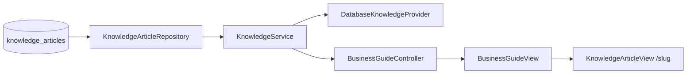

# Business Guide / Knowledge Base

## Overview

Bilingual knowledge center for Ukrainian FOP entrepreneurs. Module name in UI remains **Business Guide**.

**Package:** `com.flowiq.knowledge`  
**API:** `/api/business-guide/*`  
**Frontend:** `flowiq-frontend/src/features/business-guide/`

## Components

| Class | Role |
|-------|------|
| `KnowledgeArticle` | Entity (UK/EN fields) |
| `KnowledgeCategory` | Enum (9 categories) |
| `KnowledgeArticleRepository` | Search queries |
| `KnowledgeService` | Articles, search, dashboard snapshot |
| `BusinessGuideController` | REST API |
| `KnowledgeProvider` | AI assist extension point |
| `DatabaseKnowledgeProvider` | Rule-based scoring & summary |

## Knowledge Flow

## Categories

| Enum | Content |
|------|---------|
| FOP_GROUPS | Group 1/2/3, general system |
| TAXES | Unified tax, VAT |
| ESV | Social contributions |
| MILITARY_TAX | Military levy rules |
| DECLARATIONS | Quarterly/annual |
| KVED_DIRECTORY | Activity codes |
| ACCOUNTING_BASICS | Income ledger, expenses |
| BUSINESS_FAQ | Common questions |
| LEGAL_CHANGES | 2025–2026 updates |

## Search

`GET /api/business-guide/search?q=...`

Scores by: title, tags, content, FOP group keywords, tax type, KVED pattern (`62.01`).

Returns: `primaryArticle`, `results`, `relatedArticles`, `quickSummary`.

## Article Retrieval

- List: paginated, filter by `category`, `tag`
- Detail: by `slug`, increments `view_count`
- Related: same category + shared tags

## Dashboard Widgets

`KnowledgeDashboardSnapshotDto`:
- `popularArticles` — top by `view_count`
- `recentlyUpdated` — top by `updated_at`
- `recommendedForYou` — curated slugs
- `latestLegalChanges` — `LEGAL_CHANGES` category

## Frontend Tabs

Overview | FOP Groups | Taxes | KVED | FAQ | Knowledge Base | Updates

Route: `/business-guide?tab=faq`  
Article: `/business-guide/articles/{slug}`

## Hybrid Data Note

Knowledge articles: **PostgreSQL (API)**.  
FOP group cards, tax cards, KVED explorer, eligibility checker: **client-side mock/engine** (see [Coverage Report](../COVERAGE-REPORT.md)).

## API Reference

[Knowledge API](../api/knowledge-api.md)

## Related

- [Knowledge Search](../ai/knowledge-search.md)
