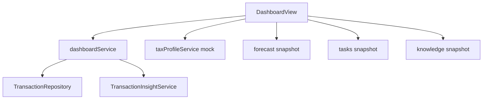

# Dashboard Module

## Overview

Central business overview combining financial stats, AI insights, charts, and module snapshots.

**Backend:** `DashboardController`, `DashboardService`  
**Frontend:** `flowiq-frontend/src/features/dashboard/`

## Widgets

| Widget | API | Component |
|--------|-----|-----------|
| Stat cards | `/dashboard/stats` | `StatCard` |
| AI summary | `/dashboard/summary` | `AISummaryCard` |
| Business health | `/dashboard/health` | `BusinessHealthCard` |
| Tax profile | Mock (frontend) | `TaxProfileCard` |
| AI insights grid | `/dashboard/insights` | `AIInsightCard` |
| Revenue chart | `/charts/revenue-trend` | `RevenueTrendChart` |
| Expense chart | `/charts/expense-breakdown` | `ExpenseBreakdownChart` |
| Forecast snapshot | `/forecast-snapshot` | `ForecastSnapshotWidget` |
| Tasks snapshot | `/tasks-snapshot` | `TasksDashboardWidget` |
| Import activity | `/imports` | `ImportDashboardWidget` |
| Business Guide | `/business-guide-snapshot` | `BusinessGuideDashboardWidget` |
| Notifications | `/notifications` | `RecentNotificationsWidget` |

## Data Dependencies

## Business Health Score

Computed in `DashboardService.getBusinessHealth()` from:
- Revenue trend
- Expense ratio
- FOP limit proximity
- Task overdue count (if integrated)

## Related

- [Dashboard API](../api/dashboard-api.md)
- [Forecast Center](forecast-center.md)
- [Tasks Center](tasks-center.md)
