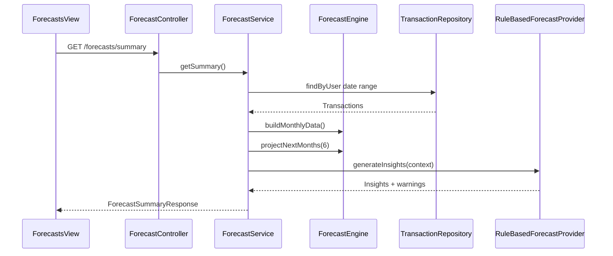

# Forecast Center Module

## Overview

Stateless forecasting module that projects revenue, expenses, profit, taxes, and FOP income limits from historical transactions.

**Package:** `com.flowiq.forecasts`  
**API:** `/api/forecasts/*`  
**Frontend:** `flowiq-frontend/src/features/forecasts/`

## Components

| Class | Role |
|-------|------|
| `ForecastController` | REST endpoints |
| `ForecastService` | Orchestration, snapshot for dashboard |
| `ForecastEngine` | Rolling averages, trend %, projections |
| `TrendAnalysis` | Month-over-month calculations |
| `MonthlyFinancialData` | Value object for time series |
| `ForecastProvider` | AI insight extension point |
| `RuleBasedForecastProvider` | Default warnings & insights |

## Forecast Flow

## Historical Calculation

1. Load user transactions (typically 12+ months via seed)
2. Aggregate by month into `MonthlyFinancialData`
3. Separate REVENUE vs EXPENSE types
4. Compute rolling 3-month average for baseline

## Trend Analysis

`TrendAnalysis` computes percent change between recent and prior periods for revenue, expenses, profit.

## Forecasting Horizon

Default **6 months** projection forward using trend-adjusted rolling averages.

## FOP Limit Forecast

Uses configured income limit by FOP group (from user financial profile / transaction analysis):
- `currentAnnualIncome` — YTD revenue sum
- `usagePercent` — income / limit
- `monthsUntilLimit` — projected months until 100% at current trend

## Insight & Warning Generation

`RuleBasedForecastProvider`:
- Income approaching FOP limit
- Expense growth exceeding revenue
- Tax burden increase alerts

Future: additional `ForecastProvider` beans (OpenAI, etc.)

## API Reference

[Forecast API](../api/forecast-api.md)

## Related

- [Forecast Engine](../ai/forecast-engine.md)
- [Dashboard snapshot](../api/dashboard-api.md)
