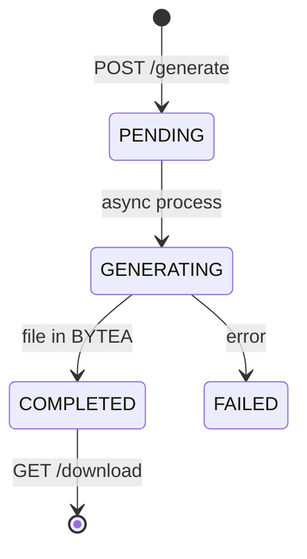

# Reports Module

**Controller:** `ReportsController`  
**Service:** `ReportsService`  
**Generator:** `ReportFileGenerator`  
**Frontend:** `features/reports/`

## Report Types

`PROFIT_AND_LOSS`, `CASH_FLOW`, `REVENUE_SUMMARY`, `EXPENSE_SUMMARY`, `TAX_SUMMARY`, `FOP_SUMMARY`

## Formats

PDF (`OpenPdfReportRenderer`), Excel (`PoiReportRenderer`), CSV

## Job Lifecycle

## Storage

`report_jobs.file_content` BYTEA — consider S3 for production scale.

## Integration

On completion: `NotificationGeneratorService.notifyReportCompleted()` + optional task for review.
