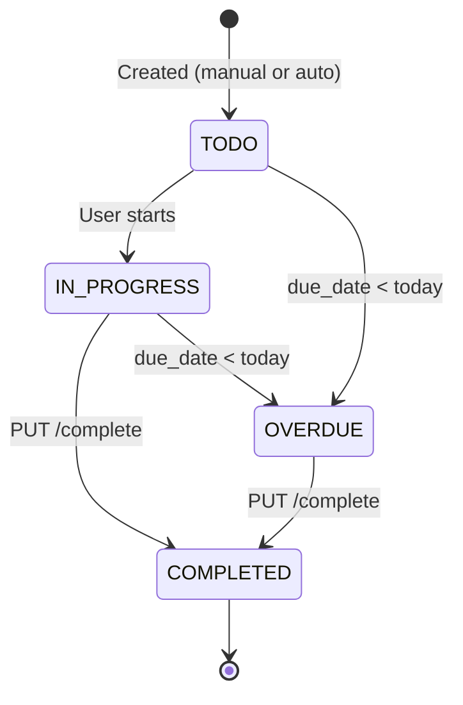
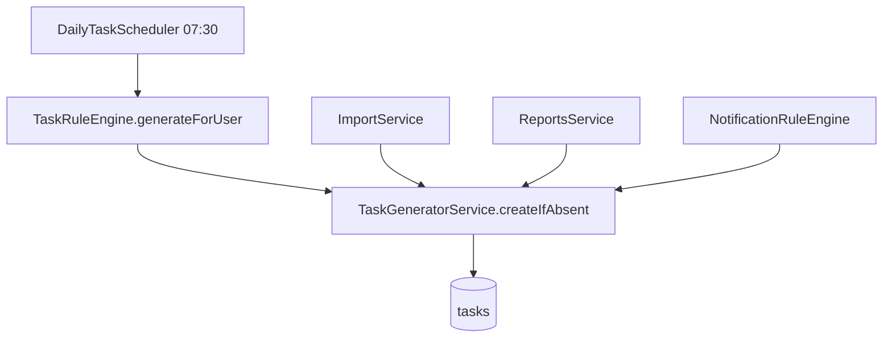

# Tasks & Deadlines Center

## Overview

Task management with automatic generation of FOP compliance deadlines.

**Package:** `com.flowiq.tasks`  
**API:** `/api/tasks/*`  
**Frontend:** `flowiq-frontend/src/features/tasks/`

## Components

| Class | Role |
|-------|------|
| `Task` | JPA entity |
| `TaskRepository` | JPA + custom queries |
| `TaskController` | REST API |
| `TaskService` | CRUD, grouping, overdue logic, snapshot |
| `TaskRuleEngine` | Business rules → task definitions |
| `TaskGeneratorService` | Idempotent task creation |
| `DailyTaskScheduler` | Cron 07:30 daily generation |

> Renamed from `TaskScheduler` to avoid Spring `taskScheduler` bean conflict.

## Task Lifecycle

## Automatic Task Creation

### Rule Examples (`TaskRuleEngine`)

- Quarterly unified tax declaration deadlines
- Monthly ЄСВ payment reminders
- Annual declaration (May 1)
- FOP limit review when usage high

### Deduplication

`deduplication_key` prevents duplicate auto-tasks per user (partial unique index).

## Notification Integration

`TaskGeneratorService.createFromNotification()` links high-priority notifications to actionable tasks.

## Dashboard Integration

`TaskService.getSnapshot()` → `GET /api/dashboard/tasks-snapshot`  
Frontend: `TasksDashboardWidget`

## Overdue Calculation

`TaskService` marks or filters tasks where `dueDate < LocalDate.now()` and status not `COMPLETED`.

## API Reference

[Tasks API](../api/tasks-api.md)

## Related

- [Notifications](notifications.md)
