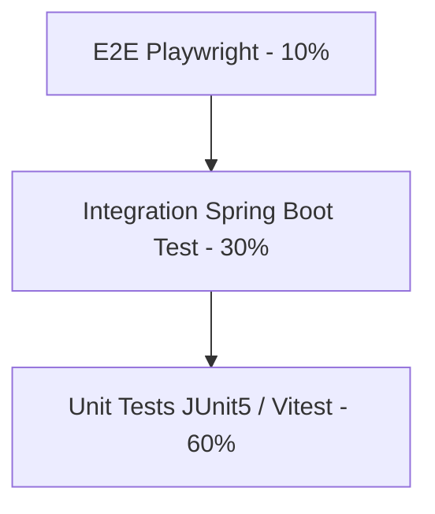

# Test Strategy

## Current State

**No automated test suite** exists in `flowiq-backend` or `flowiq-frontend` repositories today. This document defines the recommended strategy for production readiness.

## Test Pyramid

## API Testing (Backend)

| Layer | Tool | Scope |
|-------|------|-------|
| Unit | JUnit 5 + Mockito | Services, engines, providers |
| Integration | `@SpringBootTest` + Testcontainers PostgreSQL | Controllers, repositories |
| Contract | springdoc + Schemathesis | OpenAPI validation |

**Priority endpoints:**
- Auth login/register
- Transactions CRUD
- Forecast summary
- Task complete + deduplication
- Knowledge search
- Notification read-all

## UI Testing (Frontend)

| Tool | Scope |
|------|-------|
| Vitest + RTL | Hooks, utils, forms |
| Playwright | Critical user flows |

## Integration Testing

- CSV import end-to-end (Monobank sample file)
- Report generate + download
- Scheduler rules ( `@MockBean` clock)

## Security Testing

- JWT expiration / invalid token → 401
- Access other user's transaction → 404/403
- SQL injection on search params
- OWASP ZAP scan on staging

## Performance

- `/api/forecasts/summary` < 500ms with 10k transactions
- `/api/business-guide/search` < 200ms
- Dashboard parallel load < 2s

## Related

- [Critical User Flows](critical-user-flows.md)
- [Smoke Checklist](smoke-checklist.md)
