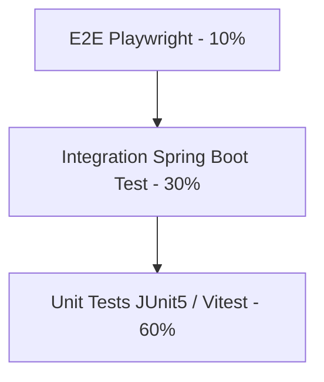

# Test Strategy

**As-built:** 2026-06-17

## Current State

| Repository | Automated tests | Status |
|------------|-----------------|--------|
| **flowiq-backend** | **9 test classes**, ~88+ test methods (JUnit 5, Mockito, AssertJ) | Unit tests for engines/services; JaCoCo configured |
| **flowiq-frontend** | **None** | No `test` script in `package.json`; no Vitest/Playwright |

See [Unit Test Coverage Report](../UNIT-TEST-COVERAGE.md) for per-class JaCoCo metrics.

### Backend test classes

```
src/test/java/com/flowiq/
├── unit/
│   ├── aiaccountant/AIRecommendationEngineTest.java
│   ├── forecasts/ForecastEngineTest.java
│   ├── forecasts/ForecastServiceTest.java
│   ├── knowledge/KnowledgeServiceTest.java
│   ├── notifications/NotificationRuleEngineTest.java
│   ├── reports/ReportsServiceTest.java
│   └── tasks/TaskRuleEngineTest.java
└── reports/
    ├── pdf/OpenPdfReportRendererTest.java
    └── excel/PoiReportRendererTest.java
```

**Not covered yet:** Controllers (`@WebMvcTest`), repositories (`@DataJpaTest`), integration tests with Testcontainers, scheduler cron behavior end-to-end.

## Test Pyramid (Target)



**Today:** Only the UNIT layer exists on backend. E2E and integration layers are **not implemented**.

## API Testing (Backend)

| Layer | Tool | Scope | Status |
|-------|------|-------|--------|
| Unit | JUnit 5 + Mockito | Services, engines, providers | **Active** — 7 classes in `com.flowiq.unit` |
| Renderer | JUnit 5 | PDF/Excel report renderers | **Active** — 2 classes |
| Integration | `@SpringBootTest` + Testcontainers PostgreSQL | Controllers, repositories | **Not implemented** |
| Contract | springdoc + Schemathesis | OpenAPI validation | **Not implemented** |

**Priority endpoints for integration tests:**
- Auth login/register
- Transactions CRUD
- Forecast summary
- Task complete + deduplication
- Knowledge search
- Notification read-all

## UI Testing (Frontend)

| Tool | Scope | Status |
|------|-------|--------|
| Vitest + RTL | Hooks, utils, forms | **Not implemented** |
| Playwright | Critical user flows | **Not implemented** |

## Integration Testing (Planned)

- CSV import end-to-end (Monobank sample file)
- Report generate + download
- Scheduler rules (`@MockBean` clock)

## Security Testing (Planned)

- JWT expiration / invalid token → 401
- Access other user's transaction → 404/403
- SQL injection on search params
- OWASP ZAP scan on staging

## Performance Targets

- `/api/forecasts/summary` < 500ms with 10k transactions
- `/api/business-guide/search` < 200ms
- Dashboard parallel load < 2s

## Running Backend Tests

```bash
cd flowiq-backend
./mvnw test
./mvnw test jacoco:report   # report at target/site/jacoco/index.html
```

## Related

- [Unit Test Coverage](../UNIT-TEST-COVERAGE.md)
- [Critical User Flows](critical-user-flows.md)
- [Smoke Checklist](smoke-checklist.md)
