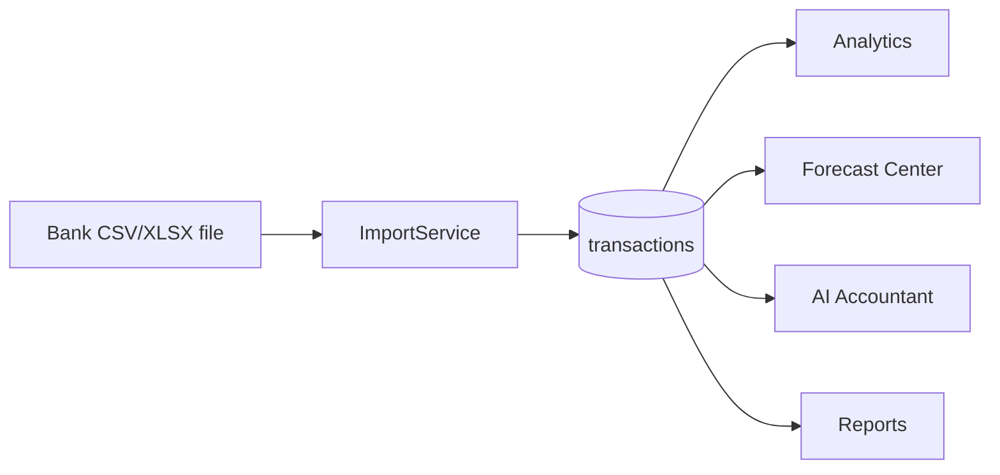

# Bank Integrations Roadmap

Flowiq does **not** support live bank API connections today. Financial data enters the platform exclusively through **CSV/XLSX bank statement import** (`POST /api/imports/upload`). This document describes the phased path toward direct bank integrations without removing existing import capabilities.

## Current State (Phase 1)

| Capability | Status | Implementation |
|------------|--------|----------------|
| Monobank CSV import | ✅ Shipped | `MonobankCsvStrategy` |
| PrivatBank CSV import | ✅ Shipped | `PrivatBankCsvStrategy` |
| Universal CSV fallback | ✅ Shipped | `UniversalCsvStrategy` |
| Live Monobank API | ❌ Planned | — |
| Live PrivatBank API | ❌ Planned | — |
| Open Banking | ❌ Planned | — |
| PUMB / Sense Bank | ❌ Not scoped | — |

**Data flow (current):**



All downstream modules read from `transactions` — never from a bank connection entity.

## Phase 2 — Monobank API

**Goal:** OAuth-based connection to Monobank personal/business API for automatic transaction sync.

### Architecture (planned)

```
Frontend                    Backend                         Monobank
────────                    ───────                         ────────
/integrations (hidden)  →   IntegrationController       →   OAuth authorize
                            IntegrationService              Token refresh
                            MonobankApiClient               GET /personal/statement
                            BankSyncScheduler               Webhook (optional)
                                    ↓
                            TransactionRepository (same table)
```

### Backend additions (not yet implemented)

| Component | Purpose |
|-----------|---------|
| `integrations` table | Provider, status, encrypted tokens, last_sync_at |
| `bank_accounts` table | External account id, IBAN, currency, provider |
| `IntegrationController` | `GET /api/integrations`, connect, disconnect, sync |
| `MonobankIntegrationProvider` | Implements `BankIntegrationProvider` |
| `BankSyncService` | Maps API payloads → `Transaction` entities (dedup by external id) |

### Design principles

- Reuse existing `Transaction` model and categorization pipeline.
- Import CSV remains available as fallback.
- Sync writes the same deduplication keys as CSV import.
- Feature flag: `flowiq.features.bank-integrations.enabled=false` (default).

## Phase 3 — PrivatBank API

**Goal:** PrivatBank business API integration (Ukraine market).

| Item | Notes |
|------|-------|
| Auth | API key or OAuth per PrivatBank documentation |
| Parser | `PrivatBankApiMapper` → shared transaction DTO |
| Scheduler | Daily sync + manual "Sync now" |
| UI | PrivatBank card on integrations hub (when enabled) |

## Phase 4 — Multi-bank Aggregation

**Goal:** Single dashboard view across Monobank, PrivatBank, and future providers.

| Item | Notes |
|------|-------|
| `BankIntegrationProvider` interface | Pluggable per bank |
| `BankSyncOrchestrator` | Parallel sync, conflict resolution |
| Account picker | User selects which accounts to sync |
| Unified dedup | `external_id` + `provider` unique constraint |

## Phase 5 — Open Banking

**Goal:** PSD2-style open banking for EU/UA expansion.

| Item | Notes |
|------|-------|
| AIS/PIS compliance | Regulatory review required |
| Consent management | Expiry, re-authorization flows |
| Real-time webhooks | Push transactions vs polling |
| Certificate management | mTLS / QWAC for TPP |

## Frontend Visibility

| Route | Visibility | Purpose |
|-------|------------|---------|
| `/imports` | Sidebar ✅ | Active import path |
| `/coming-soon/integrations` | Hidden (no sidebar) | Planned feature notice |
| `/integrations` | Redirect → coming-soon | Legacy URL compatibility |

Enable full integrations UI when `FEATURE_FLAGS.BANK_INTEGRATIONS_ENABLED` (frontend) and `flowiq.features.bank-integrations.enabled` (backend) are both `true`.

## Security Considerations

- Encrypt OAuth tokens at rest (AES-256 or vault).
- Never log raw bank credentials.
- Scope tokens to read-only transaction access where possible.
- Audit log for connect/disconnect/sync events.
- Per-user integration isolation (multi-tenant ready).

## Testing Strategy (future)

| Layer | Scope |
|-------|-------|
| Unit | API mappers, token refresh, dedup logic |
| Integration | Sandbox Monobank/PrivatBank credentials |
| Contract | OpenAPI for `/api/integrations/*` |
| E2E | Connect → sync → transactions visible |

**Current:** CSV import E2E remains the primary regression path; no bank API tests until Phase 2.

## Related Documents

- [Integration Architecture](../architecture/integration-architecture.md)
- [Transactions Module](../modules/transactions.md)
- [Product Roadmap](../product/roadmap.md)
