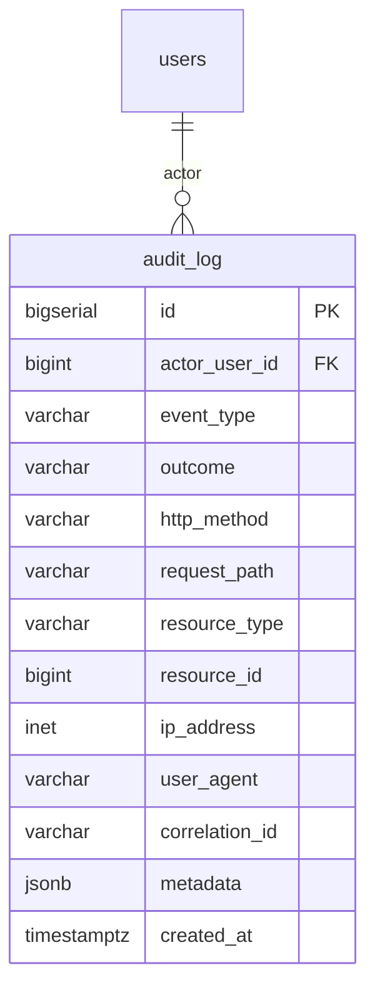
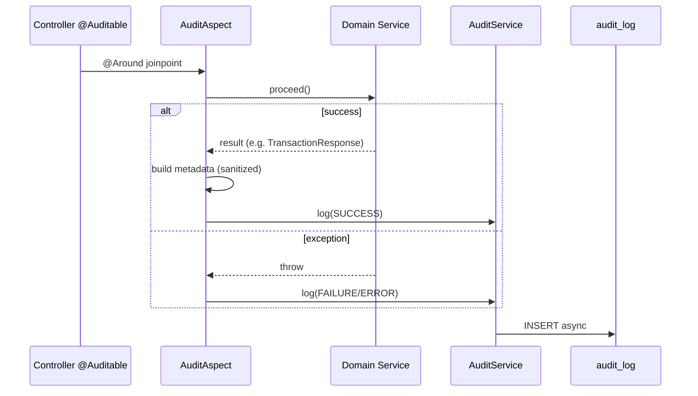
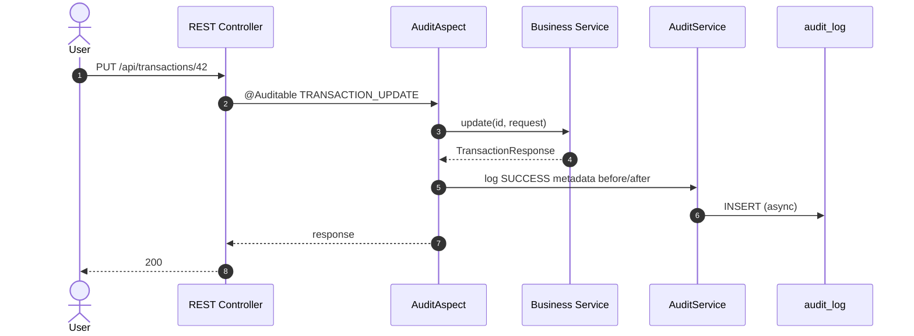

# Audit Log System — Design Document

**Design date:** 2026-06-23  
**Status:** Proposed (ADR-013 candidate)  
**Addresses:** TD-C02  
**Scope:** All HTTP mutation endpoints + selected system events  
**Related:** [SECRETS_AUDIT.md](SECRETS_AUDIT.md) · [JWT_LIFECYCLE_REVIEW.md](JWT_LIFECYCLE_REVIEW.md) · [Data Protection](data-protection.md) · [SEED_REMEDIATION_PLAN](../architecture/SEED_REMEDIATION_PLAN.md)

---

## Executive Summary

FlowIQ has **no audit trail** today (`V1–V5` migrations). Financial mutations (transactions, imports, reports) and compliance-sensitive actions (AI/tax chat) are **not recorded**.

**Proposal:** append-only `audit_log` table, `AuditService` write API, **AOP `@Auditable`** on controllers for automatic capture, **explicit logging** in auth/import for rich context, optional **AuthenticationFailureListener** for failed logins.

**Migration note:** `V6__create_audit_log.sql` — [SEED_REMEDIATION_PLAN](../architecture/SEED_REMEDIATION_PLAN.md) also targets `V6` for `transactions.source`; **coordinate:** audit log = **V6**, transaction source = **V7**.

---

## 1. Mutation Endpoint Audit (As-Built)

Scanned all 13 `@RestController` classes. **`PATCH` endpoints: 0.**

### 1.1 Complete mutation inventory

| # | Method | Path | Controller | Auth | Audit priority |
|---|--------|------|------------|------|----------------|
| 1 | POST | `/api/auth/register` | `AuthController` | Public | **P1** |
| 2 | POST | `/api/auth/login` | `AuthController` | Public | **P1** (success + failure) |
| 3 | POST | `/api/auth/logout` | `AuthController` | JWT | **P1** |
| 4 | POST | `/api/transactions` | `TransactionController` | JWT | **P1** |
| 5 | PUT | `/api/transactions/{id}` | `TransactionController` | JWT | **P1** |
| 6 | DELETE | `/api/transactions/{id}` | `TransactionController` | JWT | **P1** |
| 7 | POST | `/api/imports/upload` | `ImportController` | JWT | **P1** |
| 8 | POST | `/api/reports/generate` | `ReportsController` | JWT | **P1** |
| 9 | POST | `/api/ai-accountant/chat` | `AIAccountantController` | JWT | **P1** |
| 10 | POST | `/api/chat/message` | `ChatController` | JWT | **P2** |
| 11 | POST | `/api/tasks` | `TaskController` | JWT | **P2** |
| 12 | PUT | `/api/tasks/{id}` | `TaskController` | JWT | **P2** |
| 13 | PUT | `/api/tasks/{id}/complete` | `TaskController` | JWT | **P2** |
| 14 | DELETE | `/api/tasks/{id}` | `TaskController` | JWT | **P2** |
| 15 | PUT | `/api/notifications/{id}/read` | `NotificationController` | JWT | **P3** |
| 16 | PUT | `/api/notifications/read-all` | `NotificationController` | JWT | **P3** |
| 17 | DELETE | `/api/notifications/{id}` | `NotificationController` | JWT | **P3** |

**Future (not in code today):** `POST /api/auth/refresh` → **P1** when implemented.

**Read-only controllers (no mutations):** `DashboardController`, `AnalyticsController`, `ForecastController`, `BusinessGuideController`, `HealthController`.

### 1.2 Non-HTTP mutations (service / scheduler)

| Source | Action | Audit? | Event type |
|--------|--------|--------|------------|
| `TransactionSeedService` | Auto-insert demo transactions | **Yes (P1)** | `SYSTEM_DEMO_SEED` |
| `DemoUserSeedService` | Create demo user on startup | **Yes (P2)** | `SYSTEM_DEMO_USER_CREATED` |
| `TaskRuleEngine` / scheduler | Auto-generate tasks | **Optional (P3)** | `SYSTEM_TASK_GENERATED` |
| `NotificationScheduler` | Auto-generate notifications | **Optional (P3)** | `SYSTEM_NOTIFICATION_GENERATED` |
| `ImportService` | Bulk insert transactions | **Yes (P1)** | Covered by `IMPORT_UPLOAD` + row count in metadata |

---

## 2. Audit Event Catalog

### 2.1 Event type enum (`AuditEventType`)

| Event type | Category | Trigger | Priority | Retention tier |
|------------|----------|---------|----------|----------------|
| `AUTH_REGISTER` | AUTH | POST `/auth/register` | P1 | Financial (7y) |
| `AUTH_LOGIN_SUCCESS` | AUTH | POST `/auth/login` 200 | P1 | Financial (7y) |
| `AUTH_LOGIN_FAILURE` | AUTH | POST `/auth/login` 401 | P1 | Security (2y) |
| `AUTH_LOGOUT` | AUTH | POST `/auth/logout` | P1 | Financial (7y) |
| `AUTH_REFRESH` | AUTH | POST `/auth/refresh` (future) | P1 | Financial (7y) |
| `AUTH_REFRESH_FAILURE` | AUTH | POST `/auth/refresh` 401 | P1 | Security (2y) |
| `TRANSACTION_CREATE` | FINANCIAL | POST `/transactions` | P1 | Financial (7y) |
| `TRANSACTION_UPDATE` | FINANCIAL | PUT `/transactions/{id}` | P1 | Financial (7y) |
| `TRANSACTION_DELETE` | FINANCIAL | DELETE `/transactions/{id}` | P1 | Financial (7y) |
| `IMPORT_UPLOAD` | FINANCIAL | POST `/imports/upload` | P1 | Financial (7y) |
| `REPORT_GENERATE` | FINANCIAL | POST `/reports/generate` | P1 | Financial (7y) |
| `AI_ACCOUNTANT_CHAT` | AI_COMPLIANCE | POST `/ai-accountant/chat` | P1 | Financial (7y) |
| `CHAT_MESSAGE_SEND` | AI_COMPLIANCE | POST `/chat/message` | P2 | Standard (3y) |
| `TASK_CREATE` | PRODUCTIVITY | POST `/tasks` | P2 | Standard (3y) |
| `TASK_UPDATE` | PRODUCTIVITY | PUT `/tasks/{id}` | P2 | Standard (3y) |
| `TASK_COMPLETE` | PRODUCTIVITY | PUT `/tasks/{id}/complete` | P2 | Standard (3y) |
| `TASK_DELETE` | PRODUCTIVITY | DELETE `/tasks/{id}` | P2 | Standard (3y) |
| `NOTIFICATION_READ` | UX | PUT `/notifications/{id}/read` | P3 | Short (90d) |
| `NOTIFICATION_READ_ALL` | UX | PUT `/notifications/read-all` | P3 | Short (90d) |
| `NOTIFICATION_DELETE` | UX | DELETE `/notifications/{id}` | P3 | Short (90d) |
| `SYSTEM_DEMO_SEED` | SYSTEM | `TransactionSeedService` | P1 | Financial (7y) |
| `SYSTEM_DEMO_USER_CREATED` | SYSTEM | `DemoUserSeedService` | P2 | Standard (3y) |
| `ACCESS_DENIED` | SECURITY | 403 on mutation | P2 | Security (2y) |

### 2.2 Outcome enum (`AuditOutcome`)

| Value | Meaning |
|-------|---------|
| `SUCCESS` | Operation completed (2xx) |
| `FAILURE` | Business/validation error (4xx) |
| `ERROR` | Server error (5xx) |

### 2.3 Metadata conventions (JSONB `metadata`)

**Never store:** passwords, JWT tokens, full CSV content, report `BYTEA`, raw chat secrets.

| Event | `metadata` fields |
|-------|-------------------|
| `TRANSACTION_*` | `entityId`, `type`, `amount`, `category`, `transactionDate`, `before`/`after` (update) |
| `IMPORT_UPLOAD` | `jobId`, `fileName`, `fileSize`, `bankFormat`, `rowsImported`, `errorsCount` |
| `REPORT_GENERATE` | `jobId`, `reportType`, `format`, `periodFrom`, `periodTo`, `fileSize` |
| `AI_ACCOUNTANT_CHAT` | `messageLength`, `messageHash` (SHA-256), `replyLength`, `topics` (extracted keywords) |
| `AUTH_LOGIN_*` | `email` (normalized), **no password** |
| `AUTH_REGISTER` | `email`, `role` |
| `TASK_*` | `taskId`, `title`, `type`, `status`, `dueDate` |

**Chat / AI:** store **hash** of user message + length, not full text in MVP; optional `ai_audit_messages` table in Phase 2 for encrypted retention.

---

## 3. Database Schema

### 3.1 ER snippet



### 3.2 Table definition

| Column | Type | Nullable | Description |
|--------|------|----------|-------------|
| `id` | BIGSERIAL | NO | Primary key |
| `actor_user_id` | BIGINT | YES | FK → `users.id`; NULL for failed login / anonymous |
| `actor_email` | VARCHAR(100) | YES | Denormalized snapshot (user deleted later) |
| `actor_role` | VARCHAR(20) | YES | Role at time of event |
| `event_type` | VARCHAR(50) | NO | `AuditEventType` |
| `outcome` | VARCHAR(20) | NO | SUCCESS / FAILURE / ERROR |
| `http_method` | VARCHAR(10) | YES | POST, PUT, DELETE |
| `request_path` | VARCHAR(255) | YES | e.g. `/api/transactions/42` |
| `resource_type` | VARCHAR(50) | YES | `TRANSACTION`, `IMPORT_JOB`, … |
| `resource_id` | BIGINT | YES | Target entity ID |
| `ip_address` | INET | YES | Client IP (`X-Forwarded-For` aware) |
| `user_agent` | VARCHAR(512) | YES | Truncated |
| `correlation_id` | VARCHAR(64) | YES | Request tracing |
| `metadata` | JSONB | YES | Redacted context |
| `created_at` | TIMESTAMPTZ | NO | Immutable event time |

**Indexes:**

- `(actor_user_id, created_at DESC)` — user activity timeline  
- `(event_type, created_at DESC)` — compliance queries  
- `(resource_type, resource_id)` — entity history  
- `(created_at)` — retention purge  
- GIN on `metadata` (optional, Phase 2)

---

## 4. Flyway Migration `V6__create_audit_log.sql`

```sql
-- V6: Append-only audit log for security and financial compliance (ADR-013)

CREATE TABLE audit_log (
    id              BIGSERIAL PRIMARY KEY,
    actor_user_id   BIGINT,
    actor_email     VARCHAR(100),
    actor_role      VARCHAR(20),
    event_type      VARCHAR(50)  NOT NULL,
    outcome         VARCHAR(20)  NOT NULL,
    http_method     VARCHAR(10),
    request_path    VARCHAR(255),
    resource_type   VARCHAR(50),
    resource_id     BIGINT,
    ip_address      INET,
    user_agent      VARCHAR(512),
    correlation_id  VARCHAR(64),
    metadata        JSONB,
    created_at      TIMESTAMPTZ  NOT NULL DEFAULT NOW(),
    CONSTRAINT fk_audit_log_actor
        FOREIGN KEY (actor_user_id) REFERENCES users (id)
        ON DELETE SET NULL
);

CREATE INDEX idx_audit_log_actor_created
    ON audit_log (actor_user_id, created_at DESC);

CREATE INDEX idx_audit_log_event_created
    ON audit_log (event_type, created_at DESC);

CREATE INDEX idx_audit_log_resource
    ON audit_log (resource_type, resource_id)
    WHERE resource_id IS NOT NULL;

CREATE INDEX idx_audit_log_created_at
    ON audit_log (created_at);

COMMENT ON TABLE audit_log IS 'Append-only security and financial audit trail. No UPDATE/DELETE via application.';
```

**Note:** Application code must **never** UPDATE/DELETE rows (except retention job). DB role for app user: INSERT + SELECT only on `audit_log`.

---

## 5. Java Components

### 5.1 Package layout

```text
com.flowiq.audit/
  AuditEventType.java
  AuditOutcome.java
  ResourceType.java
  entity/AuditLog.java
  repository/AuditLogRepository.java
  dto/AuditEventRequest.java
  service/AuditService.java
  aspect/Auditable.java
  aspect/AuditAspect.java
  support/AuditMetadataSanitizer.java
  support/AuditContextHolder.java
  listener/AuthenticationAuditListener.java
  job/AuditLogRetentionJob.java
```

### 5.2 `AuditLog` entity (spec)

```java
@Entity
@Table(name = "audit_log")
@Getter
@NoArgsConstructor
public class AuditLog {

    @Id
    @GeneratedValue(strategy = GenerationType.IDENTITY)
    private Long id;

    @Column(name = "actor_user_id")
    private Long actorUserId;

    @Column(name = "actor_email", length = 100)
    private String actorEmail;

    @Column(name = "actor_role", length = 20)
    private String actorRole;

    @Enumerated(EnumType.STRING)
    @Column(name = "event_type", nullable = false, length = 50)
    private AuditEventType eventType;

    @Enumerated(EnumType.STRING)
    @Column(name = "outcome", nullable = false, length = 20)
    private AuditOutcome outcome;

    @Column(name = "http_method", length = 10)
    private String httpMethod;

    @Column(name = "request_path")
    private String requestPath;

    @Enumerated(EnumType.STRING)
    @Column(name = "resource_type", length = 50)
    private ResourceType resourceType;

    @Column(name = "resource_id")
    private Long resourceId;

    @Column(name = "ip_address", columnDefinition = "inet")
    private String ipAddress;  // or custom Inet type

    @Column(name = "user_agent", length = 512)
    private String userAgent;

    @Column(name = "correlation_id", length = 64)
    private String correlationId;

    @JdbcTypeCode(SqlTypes.JSON)
    @Column(name = "metadata", columnDefinition = "jsonb")
    private Map<String, Object> metadata;

    @CreationTimestamp
    @Column(name = "created_at", nullable = false, updatable = false)
    private Instant createdAt;
}
```

### 5.3 `AuditService` (spec)

```java
public interface AuditService {

    /** Primary write — async by default in prod */
    void log(AuditEventRequest event);

    /** Convenience */
    void logSuccess(AuditEventType type, ResourceType resourceType, Long resourceId,
                    Map<String, Object> metadata);

    void logFailure(AuditEventType type, AuditOutcome outcome,
                    Map<String, Object> metadata);

    /** Query API (Phase 2) — admin / user self-service */
    Page<AuditLogResponse> findByActor(Long userId, Pageable pageable);

    Page<AuditLogResponse> findByResource(ResourceType type, Long id, Pageable pageable);
}
```

**Implementation notes:**

- `@Async` + dedicated `auditTaskExecutor` pool — **must not block** request thread  
- `@Transactional(propagation = REQUIRES_NEW)` — audit persists even if business tx rolls back (configurable per event)  
- On audit write failure: log error + metric; **never fail** user request (fail-open for availability; alert on sustained failures)

```java
@Data
@Builder
public class AuditEventRequest {
    private Long actorUserId;
    private String actorEmail;
    private String actorRole;
    private AuditEventType eventType;
    private AuditOutcome outcome;
    private String httpMethod;
    private String requestPath;
    private ResourceType resourceType;
    private Long resourceId;
    private String ipAddress;
    private String userAgent;
    private String correlationId;
    private Map<String, Object> metadata;
}
```

---

## 6. Automatic Logging — Aspect vs Filter

### 6.1 Recommendation: **Hybrid (Aspect + explicit service calls)**

| Approach | Pros | Cons | Verdict |
|----------|------|------|---------|
| **Servlet Filter** | Catches all HTTP | No business context; logs GET noise; hard to map resource IDs | ❌ Primary |
| **AOP `@Auditable`** | Declarative on controllers; captures method args/results | Needs annotation per endpoint | ✅ **Primary** |
| **Explicit `AuditService`** | Rich metadata (import rows, auth email) | Manual | ✅ **Auth, Import, AI** |
| **Spring Security events** | Failed login without JWT | No HTTP path details alone | ✅ **Supplement** |

### 6.2 `@Auditable` annotation

```java
@Target(ElementType.METHOD)
@Retention(RetentionPolicy.RUNTIME)
public @interface Auditable {
    AuditEventType value();
    ResourceType resourceType() default ResourceType.NONE;
    /** SpEL: #result.id or #id */
    String resourceId() default "";
    boolean logOnFailure() default true;
}
```

**Example usage:**

```java
@Auditable(value = AuditEventType.TRANSACTION_CREATE,
           resourceType = ResourceType.TRANSACTION,
           resourceId = "#result.id")
@PostMapping
public ResponseEntity<TransactionResponse> create(@Valid @RequestBody CreateTransactionRequest request) {
    return ResponseEntity.status(HttpStatus.CREATED).body(transactionService.create(request));
}
```

### 6.3 `AuditAspect` flow



**Context extraction:**

- Actor: `SecurityContextHolder` → `UserPrincipal`  
- HTTP: `RequestContextHolder` → method, URI, IP, User-Agent  
- Correlation: header `X-Correlation-Id` or generated UUID in MDC  
- Metadata: `AuditMetadataSanitizer` strips `password`, `token`, `refreshToken`, `file` bytes

### 6.4 `AuthenticationAuditListener` (failed login)

```java
@Component
public class AuthenticationAuditListener {
    @EventListener
    public void onFailure(AbstractAuthenticationFailureEvent event) {
        // AUTH_LOGIN_FAILURE — email from BadCredentialsException context only
    }
}
```

Register/login success: explicit calls in `AuthService` (public endpoints have no JWT yet).

### 6.5 P3 events (notifications)

**MVP:** include with `@Auditable` but **sampled** or batched — feature flag:

```properties
flowiq.audit.notification-events-enabled=false
```

---

## 7. Target Flow Diagram



---

## 8. Read API (Phase 2)

| Endpoint | Access | Purpose |
|----------|--------|---------|
| `GET /api/audit/me` | User (own events) | GDPR access request support |
| `GET /api/audit/admin` | ADMIN | Compliance investigation |
| `GET /api/audit/resources/{type}/{id}` | User (owner) | Entity history |

Not in MVP write path — design hooks only.

---

## 9. Retention Policy

### 9.1 Tiers

| Tier | Event types | Retention | Legal driver |
|------|-------------|-----------|--------------|
| **Financial** | AUTH (except failures), TRANSACTION, IMPORT, REPORT, AI_ACCOUNTANT_CHAT, SYSTEM_DEMO_SEED | **7 years** | UA accounting / tax audit norms (configurable) |
| **Standard** | TASK, CHAT, SYSTEM_DEMO_USER | **3 years** | Product support |
| **Security** | AUTH_LOGIN_FAILURE, AUTH_REFRESH_FAILURE, ACCESS_DENIED | **2 years** | Incident investigation |
| **Short** | NOTIFICATION_* | **90 days** | Low value UX events |

### 9.2 Purge mechanism

```java
@Scheduled(cron = "0 30 3 * * SUN")  // weekly, off-peak
public void purgeExpiredEntries() {
    // DELETE FROM audit_log WHERE created_at < cutoff AND event_type IN (...)
}
```

| Property | Default |
|----------|---------|
| `flowiq.audit.retention.financial-years` | `7` |
| `flowiq.audit.retention.security-days` | `730` |
| `flowiq.audit.retention.short-days` | `90` |
| `flowiq.audit.purge-enabled` | `true` (false in dev) |

**Archival (Phase 3):** export rows to cold storage (S3 Glacier) before DELETE.

### 9.3 Immutability

- No application UPDATE/DELETE except retention job  
- Separate DB role `flowiq_audit_writer` (INSERT only) optional hardening  
- Consider PostgreSQL trigger blocking UPDATE on `audit_log`

---

## 10. GDPR & Privacy Considerations

### 10.1 Lawful basis

| Processing | Basis |
|------------|-------|
| Security audit (login failures) | **Legitimate interest** (Art. 6(1)(f)) — fraud prevention |
| Financial mutation audit | **Legal obligation** / **Contract** (Art. 6(1)(b,c)) — accounting record |
| AI chat audit (hash only) | **Legitimate interest** — prove what advice was shown |

Document in [Privacy Policy Draft](../legal/privacy-policy-draft.md) §Retention and new **Audit Log** section.

### 10.2 Data minimization

| Do | Don't |
|----|-------|
| Store actor email snapshot | Store passwords or JWT |
| Hash AI/chat message content | Store full bank CSV |
| Store amount/category on transactions | Store report file bytes |
| Truncate User-Agent to 512 chars | Log Authorization header |

### 10.3 Data subject rights

| Right | Audit log handling |
|-------|-------------------|
| **Access (Art. 15)** | `GET /api/audit/me` exports user's events |
| **Erasure (Art. 17)** | **Conflict** with legal retention — anonymize instead of delete where law requires retention |
| **Rectification (Art. 16)** | Audit log is **immutable** — append correction event `AUDIT_CORRECTION_NOTE` |
| **Portability (Art. 20)** | JSON export of user's audit entries |

### 10.4 Anonymization on account deletion

```sql
-- After user erasure request, when retention allows pseudonymization:
UPDATE audit_log
SET actor_user_id = NULL,
    actor_email = 'deleted-user-' || id || '@anonymized.local',
    metadata = metadata - 'email' - 'name'
WHERE actor_user_id = :deletedUserId
  AND created_at < NOW() - INTERVAL '7 years';  -- or full anonymize per policy
```

**Financial events within retention window:** keep `actor_email` hash or internal pseudonym ID — legal counsel review required.

### 10.5 Cross-border

If DB hosted in EU/UA — audit data stays in same region as primary DB. No replication to US analytics without SCCs.

### 10.6 DPIA trigger

Recommended before: LLM integration, accountant multi-user access, export to third-party SIEM.

---

## 11. Configuration

```properties
# application.properties
flowiq.audit.enabled=true
flowiq.audit.async=true
flowiq.audit.notification-events-enabled=false
flowiq.audit.retention.financial-years=7
flowiq.audit.retention.security-days=730
flowiq.audit.retention.short-days=90
flowiq.audit.purge-enabled=false

# application-prod.properties
flowiq.audit.purge-enabled=true
```

---

## 12. Implementation Phases

| Phase | Scope | Week |
|-------|-------|------|
| **1** | V6 migration, entity, repository, `AuditService`, `@Auditable` on P1 endpoints | 4 |
| **2** | P2 endpoints, `AuthenticationAuditListener`, correlation ID filter | 5 |
| **3** | Retention job, anonymization, `GET /api/audit/me` | 6–7 |
| **4** | ADR-013 accepted, admin API, archival | 8+ |

**MVP exit (Month 1):** P1 events writing to `audit_log` — aligns with [TECHNICAL_DEBT_REGISTER](../architecture/TECHNICAL_DEBT_REGISTER.md) TD-C02.

---

## 13. Controller Mapping Checklist

| Endpoint | `@Auditable` event |
|----------|-------------------|
| POST `/api/auth/register` | `AUTH_REGISTER` (explicit in `AuthService`) |
| POST `/api/auth/login` | `AUTH_LOGIN_SUCCESS` / listener failure |
| POST `/api/auth/logout` | `AUTH_LOGOUT` |
| POST `/api/transactions` | `TRANSACTION_CREATE` |
| PUT `/api/transactions/{id}` | `TRANSACTION_UPDATE` |
| DELETE `/api/transactions/{id}` | `TRANSACTION_DELETE` |
| POST `/api/imports/upload` | `IMPORT_UPLOAD` (explicit + row counts) |
| POST `/api/reports/generate` | `REPORT_GENERATE` |
| POST `/api/ai-accountant/chat` | `AI_ACCOUNTANT_CHAT` |
| POST `/api/chat/message` | `CHAT_MESSAGE_SEND` |
| POST/PUT/DELETE `/api/tasks/**` | `TASK_*` |
| PUT/DELETE `/api/notifications/**` | `NOTIFICATION_*` (if flag enabled) |

---

## 14. Testing Strategy

| Test | Type |
|------|------|
| `@Auditable` creates row on success | `@WebMvcTest` + Testcontainers |
| Password not in `metadata` | Unit `AuditMetadataSanitizer` |
| Failed login creates `AUTH_LOGIN_FAILURE` | Integration |
| Audit persists when business tx rolls back | Integration `REQUIRES_NEW` |
| Retention job deletes only expired P3 | Integration |

---

## 15. Related Decisions

| Item | Action |
|------|--------|
| **ADR-013** | Create: Audit Logging Strategy |
| **TD-C02** | Close when Phase 1 shipped |
| **V7** | `transactions.source` (SEED plan) — separate migration |
| **Correlation ID** | TD-M15 — wire `X-Correlation-Id` in filter |

---

**Status:** Design complete — ready for implementation  
**Owner:** Backend team  
**Reviewers:** Security, Legal (GDPR retention), Architect
