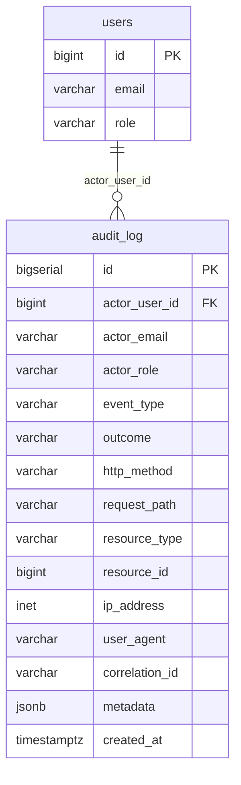
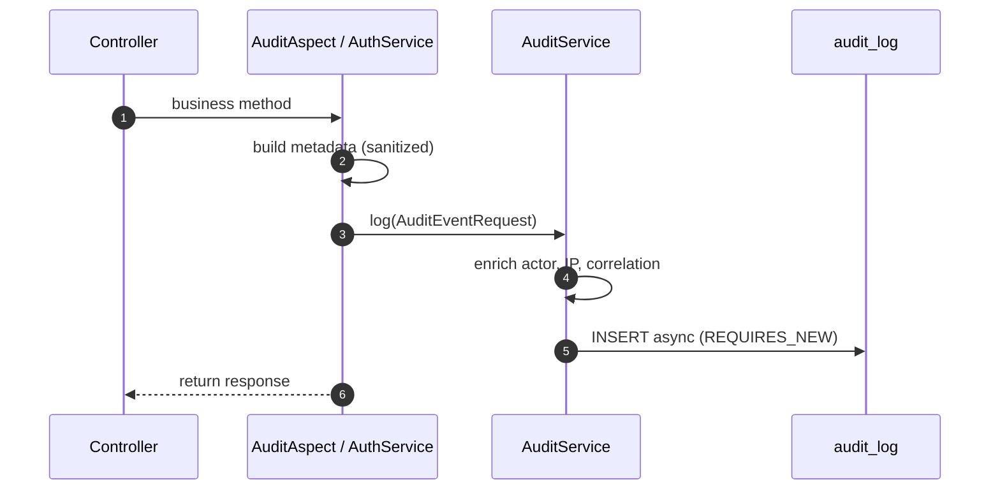

# Audit Log Implementation Report

**Date:** 2026-06-24  
**Design:** [AUDIT_LOG_DESIGN.md](AUDIT_LOG_DESIGN.md)  
**Migration:** `V6__create_audit_log.sql`  
**Status:** Phase 1 implemented

---

## Executive Summary

Production-ready append-only audit logging is implemented with:

- Flyway `V6` — `audit_log` table with indexes
- `AuditService` — async, `REQUIRES_NEW`, fail-open persistence
- `@Auditable` + `AuditAspect` — declarative controller auditing
- Explicit auth logging in `AuthService` + `AuthenticationAuditListener` for failed logins
- `AuditMetadataSanitizer` — strips JWT, passwords, CSV content, secrets
- `CorrelationIdFilter` — `X-Correlation-Id` propagation

**Tests:** 115/115 passing (`mvn test`), including 7 new audit unit tests.

---

## Changed / Added Files

| File | Purpose |
|------|---------|
| `src/main/resources/db/migration/V6__create_audit_log.sql` | Table + indexes |
| `com.flowiq.audit.AuditEventType` | Event catalog enum |
| `com.flowiq.audit.AuditOutcome` | SUCCESS / FAILURE / ERROR |
| `com.flowiq.audit.ResourceType` | Resource classification |
| `com.flowiq.audit.entity.AuditLog` | JPA entity |
| `com.flowiq.audit.repository.AuditLogRepository` | Persistence |
| `com.flowiq.audit.dto.AuditEventRequest` | Write DTO |
| `com.flowiq.audit.service.AuditService` | Public API |
| `com.flowiq.audit.service.AuditServiceImpl` | Async + sanitizer + enrich |
| `com.flowiq.audit.aspect.Auditable` | Method annotation |
| `com.flowiq.audit.aspect.AuditAspect` | AOP around advice |
| `com.flowiq.audit.support.AuditMetadataSanitizer` | Redaction |
| `com.flowiq.audit.support.AuditMetadataBuilder` | Event-specific metadata |
| `com.flowiq.audit.support.AuditContextExtractor` | Actor, IP, correlation |
| `com.flowiq.audit.filter.CorrelationIdFilter` | Request tracing |
| `com.flowiq.audit.listener.AuthenticationAuditListener` | Failed login events |
| `com.flowiq.audit.config.AuditProperties` | Feature flags |
| `com.flowiq.audit.config.AuditAsyncConfig` | `auditTaskExecutor` |
| `AuthService.java` | Explicit `AUTH_REGISTER`, `AUTH_LOGIN_SUCCESS` |
| `TransactionController.java` | `@Auditable` CRUD |
| `ImportController.java` | `@Auditable` upload |
| `ReportsController.java` | `@Auditable` generate |
| `AIAccountantController.java` | `@Auditable` chat |
| `AuthController.java` | `@Auditable` logout |
| `FlowiqBackendApplication.java` | `AuditProperties` binding |
| `application.properties` | Audit configuration |
| `pom.xml` | `spring-boot-starter-aop` |

### Tests

| File | Tests |
|------|-------|
| `AuditMetadataSanitizerTest` | 2 |
| `AuditServiceTest` | 2 |
| `AuditMetadataBuilderTest` | 3 |

---

## Events Covered (P1 — implemented)

| Event | Trigger | Mechanism |
|-------|---------|-----------|
| `AUTH_REGISTER` | POST `/api/auth/register` | Explicit `AuthService` |
| `AUTH_LOGIN_SUCCESS` | POST `/api/auth/login` 200 | Explicit `AuthService` |
| `AUTH_LOGIN_FAILURE` | POST `/api/auth/login` 401 | `AuthenticationAuditListener` |
| `AUTH_LOGOUT` | POST `/api/auth/logout` | `@Auditable` on controller |
| `TRANSACTION_CREATE` | POST `/api/transactions` | `@Auditable` |
| `TRANSACTION_UPDATE` | PUT `/api/transactions/{id}` | `@Auditable` |
| `TRANSACTION_DELETE` | DELETE `/api/transactions/{id}` | `@Auditable` |
| `IMPORT_UPLOAD` | POST `/api/imports/upload` | `@Auditable` + metadata builder |
| `REPORT_GENERATE` | POST `/api/reports/generate` | `@Auditable` |
| `AI_ACCOUNTANT_CHAT` | POST `/api/ai-accountant/chat` | `@Auditable` + message hash |

Each record includes where available:

- **Actor** — `actor_user_id`, `actor_email`, `actor_role`
- **Event type** — `event_type`
- **Outcome** — `outcome`
- **IP** — `ip_address` (X-Forwarded-For aware)
- **Correlation ID** — `correlation_id` from header or generated UUID
- **Resource ID** — `resource_id` + `resource_type`
- **Metadata JSON** — sanitized, event-specific

### Redaction (never stored)

- JWT / `token` / `refreshToken` / `Authorization`
- Passwords
- CSV file bytes / `fileContent`
- Full AI chat message text (hash + length only)
- Report `BYTEA` content

---

## Events Not Yet Covered

| Event | Priority | Notes |
|-------|----------|-------|
| `AUTH_REFRESH` / `AUTH_REFRESH_FAILURE` | P1 | Refresh endpoint exists; audit not wired |
| `CHAT_MESSAGE_SEND` | P2 | `ChatController` |
| `TASK_CREATE` / `UPDATE` / `COMPLETE` / `DELETE` | P2 | `TaskController` |
| `NOTIFICATION_READ` / `READ_ALL` / `DELETE` | P3 | Behind `flowiq.audit.notification-events-enabled` |
| `SYSTEM_DEMO_SEED` | P1 | `TransactionSeedService` |
| `SYSTEM_DEMO_USER_CREATED` | P2 | `DemoUserSeedService` |
| `ACCESS_DENIED` | P2 | 403 on mutations |
| `AUTH_REGISTER` failure | — | Duplicate email (4xx) not logged |

### Phase 2+ (design, not implemented)

- `GET /api/audit/me` — user self-service export
- `GET /api/audit/admin` — admin investigation API
- `AuditLogRetentionJob` — tiered purge
- DB role `flowiq_audit_writer` (INSERT-only)
- PostgreSQL trigger blocking UPDATE on `audit_log`
- Encrypted `ai_audit_messages` table for full chat retention

---

## ER Diagram



---

## Example Audit Log Record

**Scenario:** User creates a transaction via `POST /api/transactions`

```json
{
  "id": 1042,
  "actor_user_id": 7,
  "actor_email": "demo@flowiq.ai",
  "actor_role": "USER",
  "event_type": "TRANSACTION_CREATE",
  "outcome": "SUCCESS",
  "http_method": "POST",
  "request_path": "/api/transactions",
  "resource_type": "TRANSACTION",
  "resource_id": 128,
  "ip_address": "192.168.1.42",
  "user_agent": "Mozilla/5.0 (Windows NT 10.0; Win64; x64) AppleWebKit/537.36",
  "correlation_id": "a3f8c2e1-9b4d-4f6a-8c7e-2d1b0a9f8e7c",
  "metadata": {
    "entityId": 128,
    "type": "EXPENSE",
    "amount": 1500.00,
    "category": "Оренда",
    "transactionDate": "2026-06-01"
  },
  "created_at": "2026-06-24T08:15:33.421Z"
}
```

**Scenario:** Failed login

```json
{
  "id": 1043,
  "actor_user_id": null,
  "actor_email": null,
  "actor_role": null,
  "event_type": "AUTH_LOGIN_FAILURE",
  "outcome": "FAILURE",
  "http_method": "POST",
  "request_path": "/api/auth/login",
  "resource_type": null,
  "resource_id": null,
  "ip_address": "10.0.0.5",
  "correlation_id": "b7e2a1c0-4d3f-5e6a-9b8c-1a2b3c4d5e6f",
  "metadata": {
    "email": "attacker@example.com"
  },
  "created_at": "2026-06-24T08:16:01.102Z"
}
```

---

## Architecture Flow



---

## Configuration

```properties
flowiq.audit.enabled=true
flowiq.audit.async=true
flowiq.audit.notification-events-enabled=false
flowiq.audit.purge-enabled=false
```

---

## Remaining Limitations

| Limitation | Impact |
|------------|--------|
| No read API | Users/admins cannot query audit trail via API |
| No retention job | Table grows unbounded in dev |
| No server-side immutability enforcement | App relies on convention (no UPDATE/DELETE) |
| Refresh not audited | Token refresh lifecycle gap |
| System seed events not audited | Demo data mutations invisible |

---

**Related:** TD-C02 (partial close — P1 write path shipped) · ADR-013 (candidate)
