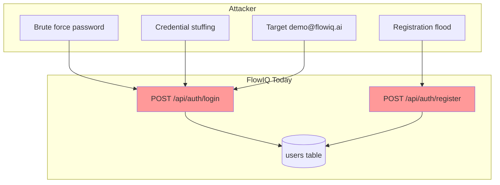
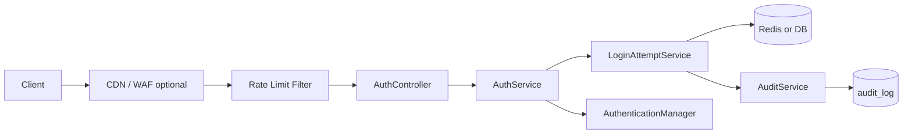

# Authentication Security Review

**Audit date:** 2026-06-23  
**Scope:** Login, register, JWT auth surface — rate limiting, lockout, throttling, failed-attempt tracking  
**Source of truth:** `flowiq-backend` code  
**Related:** [SECRETS_AUDIT.md](SECRETS_AUDIT.md) · [JWT_LIFECYCLE_REVIEW.md](JWT_LIFECYCLE_REVIEW.md) · [AUDIT_LOG_DESIGN.md](AUDIT_LOG_DESIGN.md) · TD-M07 · T-S08

---

## Executive Summary

| Control | Status |
|---------|--------|
| **Rate limiting** | ❌ Not implemented |
| **Login throttling** | ❌ Not implemented |
| **Account lockout** | ❌ Not implemented |
| **Failed attempts tracking** | ❌ Not implemented |
| **CAPTCHA** | ❌ Not implemented |
| **BCrypt password hashing** | ✅ `BCryptPasswordEncoder` |
| **Generic login error message** | ✅ `"Invalid email or password"` |
| **Audit log for auth failures** | ❌ Planned in [AUDIT_LOG_DESIGN.md](AUDIT_LOG_DESIGN.md) |

**Verdict:** MVP auth is **functionally complete** but **abuse-resistant controls are absent**. Public endpoints `/api/auth/login` and `/api/auth/register` are unlimited — suitable for local dev only. Production requires **layered throttling** (IP + account) before go-live.

---

## 1. As-Built Audit

### 1.1 Rate limiting

| Check | Result |
|-------|--------|
| Bucket4j / Resilience4j in `pom.xml` | **Absent** |
| Servlet filter / interceptor | **None** |
| API gateway / Cloudflare in repo | **Not configured** |
| `@RateLimiter` annotations | **None** |
| Nginx/ingress config in repo | **None** |

**Affected public endpoints:**

| Endpoint | Risk if unlimited |
|----------|-------------------|
| `POST /api/auth/login` | Password brute force, credential stuffing |
| `POST /api/auth/register` | Spam accounts, DB growth, email squatting |
| `POST /api/auth/logout` | Low (requires JWT) |
| `POST /api/auth/refresh` (future) | Refresh token brute force |

### 1.2 Account lockout

| Check | Result |
|-------|--------|
| `users.failed_login_attempts` column | **Absent** (`V1__initial_schema.sql`) |
| `users.locked_until` column | **Absent** |
| `UserPrincipal.isAccountNonLocked()` | Always **`true`** |
| Spring Security lockout integration | **None** |
| Admin unlock API | **None** |

Inactive users (`is_active=false`) are blocked via `UserDetails.isEnabled()` — this is **deactivation**, not **lockout after failed attempts**.

### 1.3 Login throttling

| Check | Result |
|-------|--------|
| Progressive delay after failures | **None** |
| Per-IP throttle on `/login` | **None** |
| Per-email throttle on `/login` | **None** |
| Frontend backoff / disable button | **None** (`LoginForm.tsx`) |

### 1.4 Failed attempts tracking

| Check | Result |
|-------|--------|
| DB table `login_attempts` | **Absent** |
| Redis counters | **Absent** |
| In-memory `ConcurrentHashMap` | **Absent** |
| `AuthenticationFailureListener` | **Absent** |
| Security logging of failures | **None** (only generic 401 response) |

### 1.5 What exists today (positive controls)

| Control | Implementation | Notes |
|---------|----------------|-------|
| Password hashing | BCrypt via `SecurityConfig.passwordEncoder()` | Slows offline hash crack |
| Login error opacity | `GlobalExceptionHandler` → `"Invalid email or password"` for `BadCredentialsException` | Reduces user enumeration on **login** |
| `hideUserNotFoundExceptions` | Spring `DaoAuthenticationProvider` default **true** | Unknown email → same as bad password |
| Password min length | `@Size(min=6)` on `RegisterRequest` | Weak — 6 chars only |
| JWT required for protected APIs | `SecurityConfig` | Does not protect auth endpoints |
| CORS allowlist | `CorsConfig` | Not a substitute for rate limits |
| Demo user | `demo@flowiq.ai` / `demo123` | **Known credentials** — see [SECRETS_AUDIT.md](SECRETS_AUDIT.md) |

### 1.6 User enumeration gaps

| Vector | Behavior | Severity |
|--------|----------|----------|
| Login wrong password | Generic 401 | ✅ OK |
| Login unknown email | Generic 401 (Spring default) | ✅ OK |
| Register duplicate email | **400** `"Email is already registered"` | **Medium** — reveals registered emails |
| Timing side-channel | BCrypt compare on existing users only | **Low** — mitigated partially |

---

## 2. Current Risks

| ID | Risk | Severity | Evidence |
|----|------|----------|----------|
| **AR-01** | Unlimited login attempts → online password guessing | **High** | No throttle; BCrypt only slows per attempt |
| **AR-02** | Credential stuffing with leaked passwords | **High** | No IP/account limits; 24h JWT on success |
| **AR-03** | Registration spam / bot signups | **High** | Public `POST /register` unlimited |
| **AR-04** | Demo account brute force (`demo@flowiq.ai`) | **High** | Public password in source + docs |
| **AR-05** | No forensic trail of auth abuse | **Medium** | No audit log / attempt counter (TD-C02) |
| **AR-06** | Weak password policy (min 6) | **Medium** | `RegisterRequest` |
| **AR-07** | Register email enumeration | **Medium** | Explicit duplicate message |
| **AR-08** | Horizontal scale bypass (in-memory only) | **Medium** | If MVP uses local cache without Redis |
| **AR-09** | Refresh endpoint abuse (future) | **High** | When `/auth/refresh` ships without limits |
| **AR-10** | Distributed attack from many IPs | **Medium** | Per-IP limits alone insufficient |

---

## 3. Possible Attacks

### 3.1 Attack matrix



| Attack | Description | Feasibility today | Impact |
|--------|-------------|-------------------|--------|
| **Online brute force** | Try passwords for known email | **High** — unlimited | Account takeover |
| **Password spraying** | One common password, many emails | **High** on `/register` emails | Partial takeover |
| **Credential stuffing** | Leaked creds from other sites | **High** | Takeover if password reused |
| **Registration DoS** | Mass account creation | **High** | DB bloat, ops cost |
| **Demo account abuse** | `demo123` is public | **Critical** in prod if demo enabled | Data pollution, reputational |
| **JWT stuffing** (post-login) | Stolen token reuse | **Medium** | 24h access window |
| **Refresh flooding** (future) | Guess refresh tokens | Low probability per token; high volume | DoS / lockout noise |

### 3.2 Attacker workflow (login brute force)

```text
1. POST /api/auth/login { email: victim@company.ua, password: "123456" }  → 401
2. Repeat at wire speed (no delay, no lockout)
3. On success → JWT valid 24 hours
4. No server-side record of attempts
```

### 3.3 Threat actors

| Actor | Goal | Relevant attack |
|-------|------|-----------------|
| External opportunist | Free access / vandalism | Demo creds, weak passwords |
| Competitor / troll | Service degradation | Registration flood |
| Targeted attacker | Specific FOP financial data | Brute force + stuffing |

---

## 4. Target Architecture — Defense in Depth



**Three layers (recommended):**

1. **Edge** — Cloudflare / API gateway (optional, ops)  
2. **Rate limit** — per-IP + per-email token bucket  
3. **Account lockout** — after N failures, temporary lock + audit event  

---

## 5. Solution Options

### 5.1 Comparison

| Approach | Pros | Cons | Best for |
|----------|------|------|----------|
| **A. In-memory MVP** | Zero infra; fast to ship | Not shared across instances; lost on restart | Single-node dev/staging |
| **B. Bucket4j (in-memory)** | Clean token-bucket API; per-key limits | Same scale limits as A | MVP prod **single instance** |
| **C. Bucket4j + Redis** | Distributed; survives restart; industry standard | Redis ops dependency | **Production** multi-instance |
| **D. DB-only counters** | No Redis; auditable rows | Write load; race conditions need care | Small prod, low traffic |
| **E. Gateway-only** | No app code | Per-env config; coarse granularity | Complement to B/C |

**Recommendation:** **Phase 1 — B (Bucket4j in-memory)** on staging; **Phase 2 — C (Bucket4j + Redis)** for production; **account lockout** via Redis or `login_attempts` table.

---

## 6. Detailed Design

### 6.1 Rate limiting (Bucket4j)

**Dependency (proposed):**

```xml
<dependency>
    <groupId>com.bucket4j</groupId>
    <artifactId>bucket4j-core</artifactId>
    <version>8.10.1</version>
</dependency>
<!-- Phase 2 -->
<dependency>
    <groupId>com.bucket4j</groupId>
    <artifactId>bucket4j-redis</artifactId>
    <version>8.10.1</version>
</dependency>
```

**Limits (configurable):**

| Key | Endpoint | Limit | Window |
|-----|----------|-------|--------|
| `ip:{ip}:login` | `POST /auth/login` | **10** requests | 1 minute |
| `email:{email}:login` | `POST /auth/login` | **5** requests | 1 minute |
| `ip:{ip}:register` | `POST /auth/register` | **3** requests | 1 hour |
| `ip:{ip}:refresh` | `POST /auth/refresh` | **20** requests | 1 minute |

**Response:** `429 Too Many Requests` + `Retry-After` header + body:

```json
{
  "status": 429,
  "message": "Too many requests. Please try again later.",
  "retryAfterSeconds": 42
}
```

**Filter placement:** `RateLimitFilter` **before** `JwtAuthenticationFilter` in `SecurityConfig`.

```java
// Pseudocode
@Component
@Order(Ordered.HIGHEST_PRECEDENCE + 10)
public class AuthRateLimitFilter extends OncePerRequestFilter {
    protected void doFilterInternal(...) {
        if (!isAuthEndpoint(request)) { chain.doFilter; return; }
        String ip = resolveClientIp(request);
        if (!rateLimitService.tryConsume(ip, endpoint, emailFromBodyOptional)) {
            response.setStatus(429);
            return;
        }
        chain.doFilter(request, response);
    }
}
```

### 6.2 In-memory MVP variant

```java
@Service
public class InMemoryRateLimitService implements RateLimitService {
    private final ConcurrentHashMap<String, Bucket> buckets = new ConcurrentHashMap<>();

    public boolean tryConsume(String key, Bandwidth limit) {
        Bucket bucket = buckets.computeIfAbsent(key, k -> Bucket.builder()
            .addLimit(limit).build());
        return bucket.tryConsume(1);
    }
}
```

| Property | Value |
|----------|-------|
| `flowiq.security.rate-limit.backend` | `memory` |
| Suitable | Dev, single-pod staging |
| **Not suitable** | K8s replicas > 1 |

**Mitigation for multi-instance MVP:** sticky sessions at load balancer (weak) or jump straight to Redis.

### 6.3 Redis variant (production)

```java
@Configuration
@ConditionalOnProperty(name = "flowiq.security.rate-limit.backend", havingValue = "redis")
public class RedisRateLimitConfig {
  @Bean
  public ProxyManager<String> redisProxyManager(RedissonClient redisson) {
      return RedissonBasedProxyManager.builderFor(redisson.getCommandExecutor())
          .withExpirationStrategy(ExpirationAfterWriteStrategy.fixedTimeToLive(Duration.ofHours(1)))
          .build();
  }
}
```

| Property | Example |
|----------|---------|
| `spring.data.redis.host` | `redis.internal` |
| `flowiq.security.rate-limit.backend` | `redis` |

**Keys:** `flowiq:ratelimit:login:ip:{ip}`, `flowiq:ratelimit:login:email:{normalizedEmail}`

### 6.4 Failed attempts tracking + account lockout

**Option A — Redis counters (recommended with rate limit Redis)**

```text
Key: flowiq:login:fail:email:{email}
INCR on failure; EXPIRE 15m on first fail
On success: DEL key
If count >= 5 → set flowiq:login:lock:email:{email} TTL 15m
```

**Option B — DB table `login_attempts` (audit-friendly)**

```sql
CREATE TABLE login_attempts (
    id           BIGSERIAL PRIMARY KEY,
    email        VARCHAR(100) NOT NULL,
    ip_address   INET,
    success      BOOLEAN NOT NULL,
    failure_reason VARCHAR(50),
    created_at   TIMESTAMPTZ NOT NULL DEFAULT NOW()
);
CREATE INDEX idx_login_attempts_email_created ON login_attempts (email, created_at DESC);
```

**Option C — extend `users` table**

```sql
ALTER TABLE users
    ADD COLUMN failed_login_count INT NOT NULL DEFAULT 0,
    ADD COLUMN locked_until TIMESTAMPTZ;
```

| Field | Behavior |
|-------|----------|
| `failed_login_count` | Reset on success; increment on failure |
| `locked_until` | If `NOW() < locked_until` → reject login with 423 Locked |

**Recommended hybrid:**

- **Redis** for fast lockout + rate limits (hot path)  
- **`audit_log`** for `AUTH_LOGIN_FAILURE` / `AUTH_LOGIN_SUCCESS` (compliance)  
- Optional **`login_attempts`** table if Redis unavailable  

### 6.5 Login throttling (progressive delay)

After failure count ≥ 3, add **artificial delay** before response:

```java
int delayMs = Math.min(1000 * (failCount - 2), 5000);  // max 5s
Thread.sleep(delayMs);  // or scheduled executor — never block fork-join common pool
```

Combine with Bucket4j — delay affects attacker cost; bucket caps volume.

### 6.6 `LoginAttemptService` (spec)

```java
public interface LoginAttemptService {
    void recordSuccess(String email, String ip);
    void recordFailure(String email, String ip, String reason);
    boolean isLocked(String email);
    Optional<Instant> lockedUntil(String email);
    void unlock(String email);  // admin only
}
```

**Integration in `AuthService.login`:**

```java
public AuthResponse login(LoginRequest request) {
    String email = normalize(request.getEmail());
    if (loginAttemptService.isLocked(email)) {
        throw new LockedException("Account temporarily locked. Try again later.");
    }
    try {
        Authentication auth = authenticationManager.authenticate(...);
        loginAttemptService.recordSuccess(email, clientIp());
        auditService.log(AUTH_LOGIN_SUCCESS, ...);
        return buildAuthResponse(...);
    } catch (BadCredentialsException ex) {
        loginAttemptService.recordFailure(email, clientIp(), "BAD_CREDENTIALS");
        auditService.log(AUTH_LOGIN_FAILURE, ...);
        throw ex;
    }
}
```

**HTTP status for lockout:** `423 Locked` or `429` (team choice — document in API).

### 6.7 Register endpoint hardening

| Control | Action |
|---------|--------|
| Rate limit | 3/hour per IP |
| CAPTCHA | Phase 3 — Turnstile/hCaptcha on abuse |
| Email verification | Require before full access (existing `emailVerified` unused) |
| Enumeration | Return **202** generic `"If registration succeeds, check email"` (Phase 2) |

### 6.8 Configuration

```properties
# application.properties (defaults)
flowiq.security.rate-limit.backend=memory
flowiq.security.rate-limit.login.ip-per-minute=10
flowiq.security.rate-limit.login.email-per-minute=5
flowiq.security.rate-limit.register.ip-per-hour=3

flowiq.security.lockout.enabled=true
flowiq.security.lockout.max-attempts=5
flowiq.security.lockout.duration-minutes=15
flowiq.security.lockout.progressive-delay-enabled=true

# application-prod.properties
flowiq.security.rate-limit.backend=redis
spring.data.redis.host=${REDIS_HOST}
spring.data.redis.password=${REDIS_PASSWORD}
```

---

## 7. Implementation Phases

| Phase | Deliverable | Backend | Infra |
|-------|-------------|---------|-------|
| **1 — MVP** | In-memory Bucket4j filter on login/register | `AuthRateLimitFilter`, `InMemoryRateLimitService` | None |
| **2 — Lockout** | Failed attempt tracking + 15m lock | `LoginAttemptService` (memory or Redis) | Optional Redis |
| **3 — Prod scale** | Bucket4j + Redis | `RedisRateLimitService` | Redis instance |
| **4 — Compliance** | Audit integration | `AUTH_LOGIN_*` in [AUDIT_LOG_DESIGN](AUDIT_LOG_DESIGN.md) | — |
| **5 — Hardening** | CAPTCHA, email verify gate, password policy | Frontend + `AuthService` | CDN/WAF |

**Aligns with:** [TECHNICAL_DEBT_REGISTER](../architecture/TECHNICAL_DEBT_REGISTER.md) TD-M07, Month 1–2 roadmap.

---

## 8. Monitoring & Alerting

| Metric | Alert threshold |
|--------|-----------------|
| `auth_login_failure_total` rate | > 100/min per IP |
| `auth_rate_limit_exceeded_total` | Sustained spike |
| `auth_account_lockout_total` | Unusual per-email pattern |
| `auth_register_total` | > 50/hour global |

Expose via Micrometer → Actuator (TD-H08).

---

## 9. Testing Checklist

- [ ] 11th login/min from same IP → 429  
- [ ] 6th login/min same email → 429  
- [ ] 5 failed passwords → account locked 15m  
- [ ] Successful login resets failure counter  
- [ ] Lockout returns consistent message (no enumeration)  
- [ ] Multi-instance: Redis shared state works  
- [ ] `AUTH_LOGIN_FAILURE` written to `audit_log`  
- [ ] Demo user disabled in prod → lockout N/A  

---

## 10. Decision Summary

| Question | Today | Target |
|----------|-------|--------|
| Rate limiting? | **No** | Bucket4j IP + email buckets |
| Login throttling? | **No** | Progressive delay + 429 |
| Account lockout? | **No** | 5 fails / 15 min |
| Failed attempt tracking? | **No** | Redis + audit_log |
| MVP without Redis? | — | In-memory Bucket4j + in-memory lockout (**single instance only**) |
| Production? | — | **Bucket4j + Redis** + audit |

---

## 11. Code Anchors

| Component | Path |
|-----------|------|
| Auth endpoints | `controller/AuthController.java` |
| Login logic | `service/AuthService.java:53-66` |
| Security chain | `config/SecurityConfig.java` |
| User entity (no lock fields) | `entity/User.java` |
| Error handling | `exception/GlobalExceptionHandler.java:45-49` |
| Password policy | `dto/request/RegisterRequest.java:18-20` |
| Demo credentials | `service/DemoUserSeedService.java` |
| Debt | TD-M07, T-S08 |

---

**Status:** Review complete — implementation pending  
**Owner:** Backend + Platform  
**ADR candidate:** ADR-014 Authentication Abuse Controls
