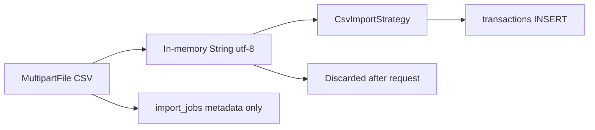
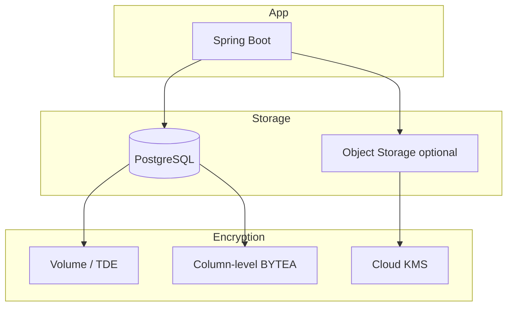

# Financial Data Security Review

**Audit date:** 2026-06-23  
**Scope:** Storage, import, reports, logging, PII exposure in `flowiq-backend`  
**Method:** Schema review, service/import/report code paths, logging config  
**Related:** [Data Protection](data-protection.md) · [SECRETS_AUDIT.md](SECRETS_AUDIT.md) · [AUDIT_LOG_DESIGN.md](AUDIT_LOG_DESIGN.md) · TD-C02 · TD-C04

---

## Executive Summary

| Area | Finding |
|------|---------|
| **`transactions`** | Plaintext PostgreSQL; per-user isolation via `user_id`; **no encryption at rest** |
| **Bank CSV import** | Raw file **not persisted** (memory only); parsed rows → `transactions` |
| **`report_jobs.file_content`** | Full PDF/CSV/XLSX in **BYTEA** — unencrypted, grows DB size |
| **Logging** | `show-sql=true` in dev; **no** structured redaction; demo password logged |
| **API leakage** | `file_content` excluded from JSON ✅; `CsvParseException` details to client ⚠️ |
| **PII in descriptions** | Bank CSV **description** field stored as-is (merchants, references) |

**Verdict:** Financial data is **logically protected** (auth + `user_id` scoping) but **not cryptographically protected**. Production requires encryption-at-rest, log redaction, SQL logging off, and report storage migration.

---

## 1. Storage Audit

### 1.1 `transactions` table

| Aspect | As-built |
|--------|----------|
| **Schema** | `V1` + `auto_categorized` (`V2`) |
| **Encryption** | None (PostgreSQL default) |
| **Tenant isolation** | `user_id` FK; services use `findByIdAndUserId` pattern |
| **Retention** | Indefinite until user deletes row |
| **Source tracking** | No `source` column (demo vs import vs manual) — TD-C04 |

**Columns with financial sensitivity:**

| Column | Content | Sensitivity |
|--------|---------|-------------|
| `amount` | UAH values | **Confidential** |
| `category` | Business category | **Internal** |
| `description` | Free text / bank narrative | **Confidential** (may contain PII) |
| `transaction_date` | Business date | **Confidential** |
| `type` | REVENUE / EXPENSE | **Internal** |

**Entity:** `com.flowiq.entity.Transaction` — exposed via `TransactionResponse` API (all fields except internal `user`).

### 1.2 Bank statement import (`ImportService`)



| Stage | Stored? | Location | Risk |
|-------|---------|----------|------|
| Raw CSV bytes | **No** | Request memory only | Low persistence risk |
| Parsed rows | **Yes** | `transactions` | Description may copy bank PII |
| Import metadata | **Yes** | `import_jobs` | `file_name` may reveal account hints |
| Parse errors | Partial | `errors_count` only | Row-level errors swallowed |

**Limits:** max **10 MB** (`ImportService.MAX_FILE_SIZE`); `.csv` extension only.

**Supported banks:** Monobank, PrivatBank, Universal — description column mapped from bank export (`опис` / `description`).

**Not stored:** card numbers as separate columns (PrivatBank detects `картка` in headers but does not persist card column as dedicated field — verify if description embeds card refs).

### 1.3 `report_jobs.file_content` (BYTEA)

| Aspect | Detail |
|--------|--------|
| **Entity** | `ReportJob.fileContent` — `@JdbcTypeCode(SqlTypes.VARBINARY)` |
| **Formats** | PDF, CSV, EXCEL via `ReportFileGenerator` |
| **Generation** | Sync in `ReportsService.generate()` — aggregates from `transactions` |
| **API exposure** | `ReportJobResponse.fromEntity()` — **excludes** `fileContent` ✅ |
| **Download** | `GET /api/reports/{id}/download` — binary stream to authenticated owner |
| **Encryption** | **None** |
| **Retention** | Indefinite in DB |

**Risk:** Full financial statements duplicated in BYTEA — **double storage** with `transactions` + large backups.

### 1.4 CSV / XLSX / PDF lifecycle

| Format | Created by | Stored | Transmitted |
|--------|------------|--------|-------------|
| **CSV** (import) | User upload | Not stored raw | HTTPS multipart |
| **CSV** (export report) | `ReportFileGenerator` | BYTEA in `report_jobs` | Download endpoint |
| **XLSX** | `PoiReportRenderer` | BYTEA | Download endpoint |
| **PDF** | `OpenPdfReportRenderer` | BYTEA | Download endpoint |

**Temp files:** None — all in-memory `byte[]` before DB write.

### 1.5 Related financial-adjacent storage

| Table | Financial data | Notes |
|-------|----------------|-------|
| `chat_messages.content` | User questions, AI replies with amounts | Plaintext TEXT |
| `chat_conversations.title` | May reflect topic | Lower sensitivity |
| `import_jobs` | Metadata only | `file_name`, counts |
| `users` | PII + auth | email, name, company |
| `audit_log` (planned) | Event metadata | Must not store full CSV/chat |

---

## 2. Logging & Leakage Audit

### 2.1 Application logging configuration

| Setting | Value | Risk |
|---------|-------|------|
| `spring.jpa.show-sql` | **`true`** (default `application.properties`) | **High** — SQL + bind params in logs |
| `spring.jpa.properties.hibernate.format_sql` | `true` | Readable amounts in SQL |
| `application-docker.properties` | `show-sql=false` | ✅ Docker profile safer |
| Structured JSON logging | **Not configured** | — |
| Request body logging | **None** | ✅ |
| CSV content logging | **None** in code | ✅ |

### 2.2 Code paths that log sensitive data

| Location | What is logged | Severity |
|----------|----------------|----------|
| `DemoUserSeedService:41` | **Demo email + plaintext password** | **Critical** |
| `NotificationScheduler` | `user.getId()` on failure | Low |
| `DailyTaskScheduler` | `user.getId()` on failure | Low |
| `PdfFontProvider` | Font paths only | Low |

**Lombok `@Data` on entities:** implicit `toString()` includes all fields — **risk if entity ever logged**. No current `log.info(transaction)` found.

### 2.3 Exception message leakage

| Handler | Behavior | PII/financial risk |
|---------|----------|-------------------|
| `BadCredentialsException` | Generic message | ✅ OK |
| `BadRequestException` | **`ex.getMessage()` forwarded** | ⚠️ `CsvParseException`: `"Invalid amount: {value}"` |
| `UnauthorizedException` | Message forwarded | Low |
| `ResourceNotFoundException` | Message forwarded | Low |
| `Exception` (catch-all) | Generic `"An unexpected error occurred"` | ✅ No stack to client |
| `CustomUserDetailsService` | `"User not found: {email}"` | Internal; wrapped by Spring if login |

**Import risk:** `throw new BadRequestException(e.getMessage())` on `CsvParseException` — does not expose full CSV but may expose parsed fragments.

### 2.4 Frontend & transport

| Vector | Status |
|--------|--------|
| HTTPS production | Documented requirement; not enforced in code |
| JWT in `localStorage` | XSS → API access to all financial data |
| `NEXT_PUBLIC_*` secrets | None |
| Browser console | No centralized logging policy |

### 2.5 Swagger / OpenAPI

Public in dev (`SecurityConfig` permitAll) — exposes API shape, not data. Disable in prod (TD-H13).

---

## 3. Data Classification Matrix

| Classification | Definition | Examples in FlowIQ | Storage | Encryption today |
|----------------|------------|-------------------|---------|------------------|
| **C-1 Critical** | Credential / crypto keys | `users.password` (bcrypt), `jwt.secret` | DB / properties | Hash only (password) |
| **C-2 Restricted** | Financial records & tax outputs | `transactions.*`, `report_jobs.file_content`, FOP aggregates | PostgreSQL BYTEA | **None** |
| **C-3 Confidential** | PII + business identity | `users.email`, `name`, `company` | PostgreSQL | **None** |
| **C-4 Internal** | Operational metadata | `import_jobs`, `report_jobs` status, categories | PostgreSQL | None |
| **C-5 Sensitive communication** | User-authored financial text | `chat_messages.content`, AI accountant chat (future audit) | PostgreSQL TEXT | None |
| **C-6 Public** | Non-user regulatory content | `knowledge_articles` | PostgreSQL | N/A |

### 3.1 Field-level classification (financial tables)

| Table.column | Class | Sensitive? | Notes |
|--------------|-------|------------|-------|
| `transactions.amount` | C-2 | **Yes** | Core financial fact |
| `transactions.description` | C-2 | **Yes** | May contain merchant/counterparty PII |
| `transactions.category` | C-4 | Partial | Business metadata |
| `transactions.transaction_date` | C-2 | **Yes** | |
| `report_jobs.file_content` | C-2 | **Yes** | Full report duplicate |
| `report_jobs.period_from/to` | C-2 | **Yes** | |
| `import_jobs.file_name` | C-3/C-4 | Partial | User-controlled string |
| `users.email` | C-3 | **Yes** | PII |
| `users.password` | C-1 | **Yes** | Bcrypt hash |
| `chat_messages.content` | C-5 | **Yes** | May quote amounts, tax situation |

---

## 4. Sensitive Fields — Policy

### 4.1 Always treat as Sensitive (never log, mask in UI exports)

- `users.password` (never log — hash only in DB)
- JWT / refresh tokens
- Raw CSV / uploaded file bytes
- `report_jobs.file_content`
- Full `chat_messages.content` (log hash + length only)
- AI accountant user message body (same as chat)
- Bank card / IBAN if detected in `description` (future sanitizer)

### 4.2 Sensitive in aggregate (log only summaries)

| Field | Allowed in logs |
|-------|-----------------|
| `transactions.amount` | **No** per-row; OK as `userId + count + sum` in metrics |
| `transactions.description` | **No** |
| `import_jobs.file_name` | **Masked** — basename only, truncate 50 chars |
| `users.email` | **Masked** — `u***@domain.com` |
| `users.name` | **No** in production info logs |

### 4.3 Safe for operational logs

- `user_id`, `transaction_id`, `import_job_id`, `report_job_id`
- HTTP method, path (no query string with dates if sensitive)
- `event_type`, `outcome`, `correlation_id`
- Row counts: `rows_imported`, `errors_count`
- Report `format`, `report_type`, `status`

---

## 5. Log Masking Rules

### 5.1 Recommended `logback-spring.xml` pattern (production)

```xml
<!-- Pseudocode — use custom converter -->
<property name="MASKED_MSG" value="%replace(%msg){'password=\\S+', 'password=***'}"/>
```

### 5.2 `LogSanitizer` utility (proposed)

| Input type | Rule |
|------------|------|
| Email | `maskEmail("user@corp.ua")` → `u***@corp.ua` |
| Amount | Never log; if required: `****.** UAH` |
| Description | Log `sha256(description)` prefix 8 chars + length |
| File name | Strip path; mask middle: `state***2024.csv` |
| JWT | Never log; if debug: first 8 chars + `...` |
| SQL params | **Disable** — `show-sql=false` |

### 5.3 Hibernate / SQL

```properties
# application-prod.properties — mandatory
spring.jpa.show-sql=false
spring.jpa.properties.hibernate.format_sql=false
logging.level.org.hibernate.SQL=WARN
logging.level.org.hibernate.orm.jdbc.bind=WARN
```

### 5.4 Audit log metadata (cross-ref AUDIT_LOG_DESIGN)

Per [AUDIT_LOG_DESIGN.md](AUDIT_LOG_DESIGN.md): store `messageHash`, `messageLength` for AI/chat — **not** full text.

---

## 6. Exception Message Policy

### 6.1 Must NOT appear in client-facing `ErrorResponse.message`

| Source | Bad example | Safe replacement |
|--------|-------------|------------------|
| CSV parse | `Invalid amount: 1.234,56` | `Invalid row in CSV file` |
| CSV parse | `Unsupported date format: 01/02/03` | `Invalid date in CSV file` |
| DB constraint | Postgres detail with column values | `Could not save transaction` |
| Auth | `User not found: email@x.com` | `Invalid email or password` |
| Stack traces | Any | Generic 500 message (already OK) |

### 6.2 Implementation (proposed)

```java
// CsvParseException → always map to generic client message
catch (CsvParseException e) {
    log.warn("CSV parse failed for user {}: {}", userId, e.getMessage()); // server log only
    throw new BadRequestException("Could not parse CSV file. Check format and try again.");
}
```

### 6.3 Safe to return to client

- Validation field errors (email format, password length)
- `Import job not found` / `Report not found` (no data leak)
- Business rules without embedded user data

---

## 7. PII Leak Vectors — Summary

| ID | Vector | Likelihood | Impact | Mitigation |
|----|--------|------------|--------|------------|
| **FL-01** | SQL logging in dev/prod misconfig | Medium | High | `show-sql=false` in prod |
| **FL-02** | Demo password in startup log | High (if enabled) | Medium | Remove password from log line |
| **FL-03** | `transactions.description` from bank CSV | High | Medium | Import sanitizer; retention policy |
| **FL-04** | BYTEA reports in DB backup | High | High | Encrypt backups; migrate to object storage |
| **FL-05** | XSS → JWT → full financial API | Medium | Critical | CSP; cookie auth (long-term) |
| **FL-06** | `file_name` on import | Low | Low | Sanitize on display |
| **FL-07** | Chat content in DB breach | Medium | High | Encryption; minimize retention |
| **FL-08** | Exception messages on import | Low | Low | Generic client errors |
| **FL-09** | Cross-tenant access bug | Low | Critical | Integration tests on `user_id` |
| **FL-10** | Unencrypted `pg_dump` files | Medium | Critical | Encrypted backup storage |

---

## 8. Encryption at Rest — Recommendations

### 8.1 Layered model



| Layer | Recommendation | Priority |
|-------|----------------|----------|
| **Infrastructure** | Enable **full-disk encryption** on DB volume (AWS RDS encryption, GCP CMEK) | **P0** |
| **PostgreSQL TDE** | Use managed service default encryption | **P0** |
| **`report_jobs.file_content`** | Migrate to **S3/GCS** with **SSE-KMS**; store pointer in DB | **P1** |
| **Application-level BYTEA** | `pgcrypto` `pgp_sym_encrypt` per user DEK — high complexity | P3 fallback |
| **`transactions.description`** | Field-level encryption rarely justified; rely on volume TDE + access control | P2 optional |
| **Backups** | Encrypted snapshots; separate CMK | **P0** |
| **Secrets** | KMS for `jwt.secret`, DB password — see [SECRETS_AUDIT.md](SECRETS_AUDIT.md) | **P0** |

### 8.2 Target architecture — reports offloaded

```sql
-- Future migration V8+
ALTER TABLE report_jobs
    ADD COLUMN storage_key VARCHAR(500),
    ADD COLUMN storage_bucket VARCHAR(100);
-- Deprecate file_content; encrypt at rest in S3 SSE-KMS
```

### 8.3 Key management

| Key | Rotation | Storage |
|-----|----------|---------|
| DB encryption | Managed by cloud | RDS/GCP |
| S3 SSE-KMS | Annual | AWS KMS / GCP KMS |
| App DEK (if used) | Per-user optional | Envelope encryption with KMS |

### 8.4 Encryption in transit

- TLS 1.2+ termination at load balancer  
- `sslmode=require` on JDBC in production  
- HSTS on frontend  

---

## 9. Backup Security — Recommendations

### 9.1 Current state (dev)

```bash
docker exec flowiq-postgres pg_dump -U flowiq flowiq > backup.sql
```

| Gap | Risk |
|-----|------|
| Plaintext SQL file on disk | Contains **all** financial data + BYTEA hex |
| No access control on file | Local machine exposure |
| Same credentials as app | `flowiq123` |

### 9.2 Production backup policy

| Control | Requirement |
|---------|-------------|
| **Automated backups** | Daily snapshots + **PITR** (WAL) |
| **Encryption** | Snapshot encryption at rest (CMK) |
| **Access** | IAM least privilege; no public buckets |
| **Separation** | Backup account/VPC separate from runtime |
| **Retention** | 30 days operational; 7 years tax archives **encrypted** (legal review) |
| **Restore testing** | Quarterly drill; audit who restored |
| **BYTEA handling** | `pg_dump` includes report files — treat backup as **C-2 Restricted** |
| **Deletion** | On user erasure request — backup purge policy documented (GDPR) |

### 9.3 Backup access matrix

| Role | Backup read | Restore execute |
|------|-------------|-----------------|
| App runtime DB user | **No** | **No** |
| DBA / DevOps | Yes (break-glass) | Yes (approved ticket) |
| Developers | **No** prod | **No** prod |
| Application | **No** | **No** |

### 9.4 Disaster recovery (enhance existing doc)

Align with [backup-recovery.md](../operations/backup-recovery.md):

- Encrypt backup transfer (TLS + encrypted object storage)  
- After restore: rotate credentials if breach suspected  
- Verify `user_id` isolation post-restore with smoke tests  
- **Do not** restore prod backup to unsecured dev machines  

---

## 10. GDPR & Ukrainian Context

| Requirement | FlowIQ action |
|-------------|---------------|
| **Data minimization** | Do not store raw CSV; consider description truncation |
| **Purpose limitation** | Financial data only for stated FOP features |
| **Storage limitation** | Retention job for old reports (e.g. 90d) + audit policy |
| **Right of access** | Export API: transactions + report list |
| **Right to erasure** | Delete user → cascade transactions, reports, chat; backup policy |
| **DPA** | Required for B2B accountant access (not implemented) |
| **UA accounting confidentiality** | BYTEA reports + transactions = professional secrecy scope |

---

## 11. Implementation Roadmap

| Phase | Deliverable | Addresses |
|-------|-------------|-----------|
| **1** | `show-sql=false` prod; fix `DemoUserSeedService` log; generic CSV errors | FL-01, FL-02, FL-08 |
| **2** | `LogSanitizer` + JSON logging; audit log without raw chat | FL-03, logging policy |
| **3** | RDS encryption + encrypted backups | FL-04, FL-10 |
| **4** | Reports → S3 SSE-KMS; `file_content` deprecation | BYTEA risk |
| **5** | Import description sanitizer (card/IBAN regex); `transactions.source` | FL-03, TD-C04 |
| **6** | User data export/delete + backup erasure runbook | GDPR |

---

## 12. Code & Schema Anchors

| Asset | Path |
|-------|------|
| Transactions schema | `db/migration/V1__initial_schema.sql` |
| Report BYTEA | `entity/ReportJob.java:52-54` |
| Import flow | `service/ImportService.java` |
| Report generation | `service/ReportsService.java` |
| API excludes BYTEA | `dto/response/ReportJobResponse.java` |
| SQL logging | `application.properties:11-13` |
| Logging policy doc | `docs/operations/logging.md` |
| Backup doc | `docs/operations/backup-recovery.md` |

---

**Status:** Review complete — design and policy recommendations only  
**Owner:** Backend + Security + DBA  
**Next:** Phase 1 quick wins before production deploy
