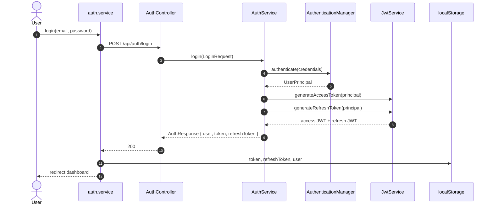
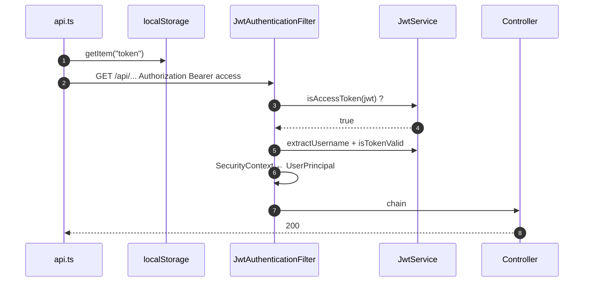
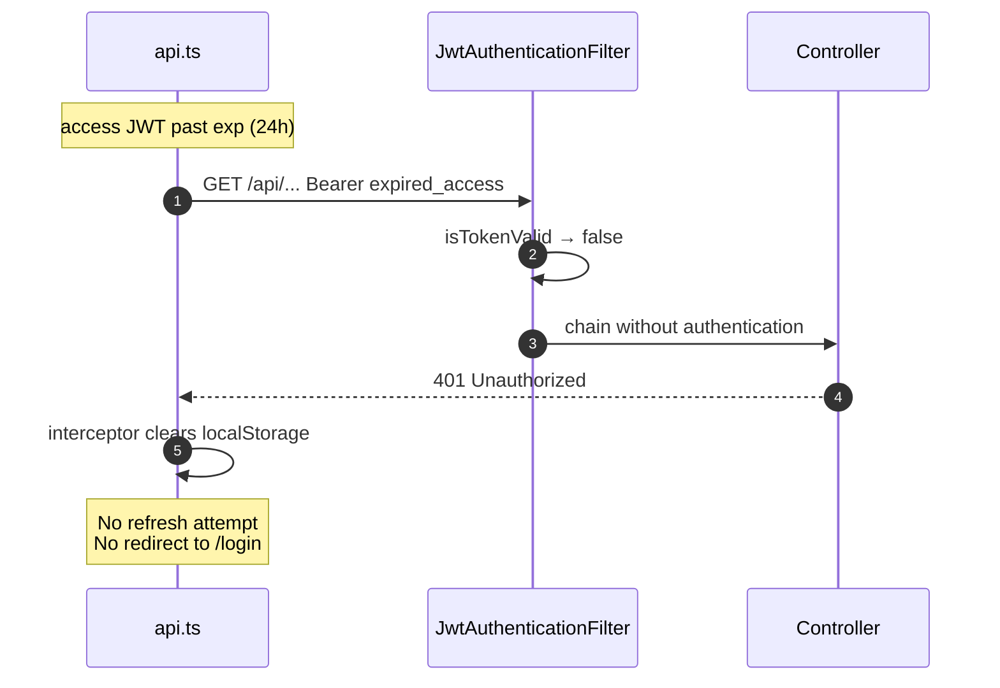
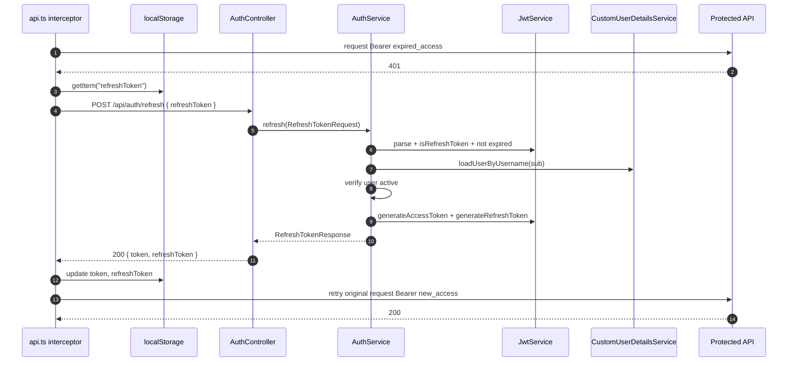
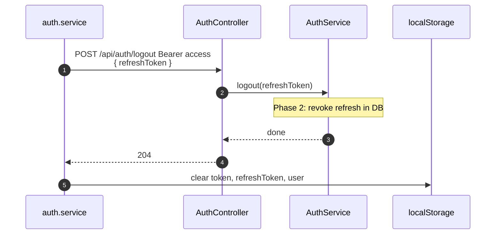

# JWT Lifecycle Review

**Audit date:** 2026-06-23  
**Scope:** Token creation, consumption, refresh gap, target lifecycle  
**Source of truth:** `flowiq-backend` + `flowiq-frontend` code  
**Related:** [JWT Remediation Plan](../architecture/JWT_REMEDIATION_PLAN.md) · [JWT Storage Review](JWT_STORAGE_SECURITY_REVIEW.md) · [ADR-006](../architecture/adr/006-jwt-authentication-strategy.md) · TD-C06

---

## Executive Summary

| Question | Answer |
|----------|--------|
| Where is **access token** created? | `JwtService.generateAccessToken()` ← `AuthService.buildAuthResponse()` |
| Where is **refresh token** created? | `JwtService.generateRefreshToken()` ← same path |
| Who **uses** access token? | `JwtAuthenticationFilter` (backend); `api.ts` interceptor (frontend) |
| Who **uses** refresh token? | **Nobody** — stored in `localStorage`, never sent |
| Does `POST /api/auth/refresh` exist? | **No** |

**Gap:** refresh token выдаётся при login/register, но lifecycle обрывается — после истечения access (24h) пользователь теряет сессию без silent refresh.

---

## 1. Audit — Token Creation

### 1.1 Access token

```text
POST /api/auth/login | POST /api/auth/register
  AuthController
    → AuthService.login() | register()
      → AuthService.buildAuthResponse()          // private, lines 81–90
        → JwtService.generateAccessToken(principal)
          → generateToken(..., accessTokenExpiration, "access")
            → claim: type=access, sub=email, userId, role, exp
```

| Property | Value |
|----------|-------|
| Class | `com.flowiq.security.JwtService` |
| Method | `generateAccessToken(UserDetails)` |
| TTL (dev) | 86 400 000 ms (**24 h**) — `jwt.access-token-expiration` |
| Algorithm | HS256 (`jwt.secret`) |

### 1.2 Refresh token

```text
Same call chain as access:
  AuthService.buildAuthResponse()
    → JwtService.generateRefreshToken(principal)
      → generateToken(..., refreshTokenExpiration, "refresh")
        → claim: type=refresh, sub=email, userId, role, exp
```

| Property | Value |
|----------|-------|
| Method | `generateRefreshToken(UserDetails)` |
| TTL (dev) | 604 800 000 ms (**7 d**) — `jwt.refresh-token-expiration` |
| Issuance trigger | **Only** login + register (no rotation) |

### 1.3 Response envelope

`AuthResponse` (`token`, `refreshToken`, `user`) returned by:

- `POST /api/auth/login` → 200  
- `POST /api/auth/register` → 201  

---

## 2. Audit — Token Consumers

### 2.1 Access token consumers

| Consumer | Location | Behavior |
|----------|----------|----------|
| **JwtAuthenticationFilter** | `security/JwtAuthenticationFilter.java` | Reads `Authorization: Bearer`; accepts **only** `type=access`; sets `SecurityContext` |
| **api.ts request interceptor** | `flowiq-frontend/src/services/api.ts` | `localStorage.getItem("token")` → Bearer header on every API call |
| **Protected controllers** | All `/api/*` except permitAll | Rely on filter-populated context |
| **Swagger** | Manual Bearer in dev | — |

**Not consumers:** `AuthService.getCurrentUser()` reads `SecurityContext`, not raw JWT.

### 2.2 Refresh token consumers

| Consumer | Uses refresh? |
|----------|---------------|
| Backend | **No endpoint, no filter path** |
| `auth.service.ts` | Writes to `localStorage`; `refreshToken()` **throws** |
| `api.ts` | Clears on 401; **never reads** for requests |
| `JwtAuthenticationFilter` | **Rejects** refresh JWT (`!isAccessToken`) |

### 2.3 Frontend persistence (after issuance)

| Key | Written | Read for API |
|-----|---------|--------------|
| `token` | login, register | **Yes** — Bearer |
| `refreshToken` | login, register | **No** |
| `user` | login, register, `/auth/me` | Display only |

### 2.4 Auth endpoints matrix

| Endpoint | Access JWT required? | Issues tokens? | Server invalidation? |
|----------|---------------------|----------------|----------------------|
| `POST /auth/register` | No | Yes (pair) | — |
| `POST /auth/login` | No | Yes (pair) | — |
| `GET /auth/me` | Yes | No | — |
| `POST /auth/logout` | Yes | No | **No** (204 only) |
| `POST /auth/refresh` | — | **Missing** | — |

---

## 3. Current Lifecycle — Sequence Diagrams

### 3.1 Login



### 3.2 Authenticated API request



### 3.3 Access token expired (actual behavior)



---

## 4. Target Lifecycle — Sequence Diagrams

### 4.1 Login (unchanged contract)

Login/register response shape **unchanged** — backward compatible.

### 4.2 Refresh (target)



### 4.3 Logout (target — Phase 2)



---

## 5. Specification — `POST /api/auth/refresh`

### 5.1 Overview

| Property | Value |
|----------|-------|
| **Method** | `POST` |
| **Path** | `/api/auth/refresh` |
| **Auth** | **Public** (no Bearer required) |
| **Purpose** | Exchange valid refresh JWT for new access + refresh pair |
| **Idempotency** | Not idempotent if rotation enabled (Phase 2) |

### 5.2 Request

**Headers:**

| Header | Required | Value |
|--------|----------|-------|
| `Content-Type` | Yes | `application/json` |
| `Authorization` | No | Must **not** be required |

**Body — `RefreshTokenRequest`:**

```json
{
  "refreshToken": "eyJhbGciOiJIUzI1NiJ9..."
}
```

| Field | Type | Required | Validation |
|-------|------|----------|------------|
| `refreshToken` | string | Yes | `@NotBlank` |

### 5.3 Success response

**Status:** `200 OK`

**Body — `RefreshTokenResponse`:**

```json
{
  "token": "eyJhbGciOiJIUzI1NiJ9...",
  "refreshToken": "eyJhbGciOiJIUzI1NiJ9..."
}
```

| Field | Type | Description |
|-------|------|-------------|
| `token` | string | New JWT access token (`type=access`) |
| `refreshToken` | string | New JWT refresh token (`type=refresh`) |

**Note:** `user` **not** included — client already has profile; reduces payload. Optional: include `user` for parity with `AuthResponse` (not recommended).

### 5.4 Error responses

| Status | Condition | Body |
|--------|-----------|------|
| `400` | Missing/blank `refreshToken` | `ApiError` validation message |
| `401` | Invalid signature, wrong `type`, expired, user inactive/deleted | `{ "message": "Invalid or expired refresh token" }` |
| `401` | Phase 2: revoked or reuse detected | `{ "message": "Refresh token revoked" }` |

Uses existing `GlobalExceptionHandler` + `UnauthorizedException` / `BadRequestException`.

### 5.5 Server-side validation rules

1. Parse JWT with `JwtService` signing key  
2. **`type` claim MUST equal `"refresh"`** — reject access tokens  
3. **`exp` not passed**  
4. **`sub` (email) present** — load user via `CustomUserDetailsService`  
5. **`user.isActive() == true`**  
6. **`isTokenValid(token, userDetails)`** — subject match  
7. Phase 2: verify token hash in `refresh_tokens` table (not revoked)

### 5.6 OpenAPI snippet

```yaml
/api/auth/refresh:
  post:
    tags: [Auth]
    summary: Refresh JWT tokens
    security: []
    requestBody:
      required: true
      content:
        application/json:
          schema:
            $ref: '#/components/schemas/RefreshTokenRequest'
    responses:
      '200':
        description: New token pair
        content:
          application/json:
            schema:
              $ref: '#/components/schemas/RefreshTokenResponse'
      '401':
        description: Invalid or expired refresh token
```

---

## 6. Required Changes (Implementation Spec)

### 6.1 DTO

**New file:** `src/main/java/com/flowiq/dto/request/RefreshTokenRequest.java`

```java
@Data
@Schema(description = "Refresh token request")
public class RefreshTokenRequest {
    @NotBlank(message = "Refresh token is required")
    @Schema(description = "JWT refresh token", requiredMode = Schema.RequiredMode.REQUIRED)
    private String refreshToken;
}
```

**New file:** `src/main/java/com/flowiq/dto/response/RefreshTokenResponse.java`

```java
@Data
@Builder
@NoArgsConstructor
@AllArgsConstructor
@Schema(description = "New JWT token pair after refresh")
public class RefreshTokenResponse {
    @Schema(description = "New JWT access token")
    private String token;

    @Schema(description = "New JWT refresh token")
    private String refreshToken;
}
```

### 6.2 `JwtService`

**Add methods:**

```java
public boolean isRefreshToken(String token) {
    return "refresh".equals(extractClaim(token, c -> c.get("type", String.class)));
}

public void validateRefreshToken(String token) {
    // parse claims; throw JwtException / UnauthorizedException if invalid type or expired
}

public String extractUserId(String token) { ... }  // optional, from claim
```

**Keep private:** `extractAllClaims` — reuse for refresh validation.

### 6.3 `AuthService`

**Add method:**

```java
public RefreshTokenResponse refresh(RefreshTokenRequest request) {
    String refreshToken = request.getRefreshToken().trim();

    // 1. validateRefreshToken (signature, exp, type=refresh)
    String email = jwtService.extractUsername(refreshToken);
    UserDetails userDetails = customUserDetailsService.loadUserByUsername(email);

    if (!userDetails.isEnabled()) {
        throw new UnauthorizedException("Invalid or expired refresh token");
    }
    if (!jwtService.isRefreshToken(refreshToken)
            || !jwtService.isTokenValid(refreshToken, userDetails)) {
        throw new UnauthorizedException("Invalid or expired refresh token");
    }

    UserPrincipal principal = (UserPrincipal) userDetails;
    String newAccess = jwtService.generateAccessToken(principal);
    String newRefresh = jwtService.generateRefreshToken(principal);

    return RefreshTokenResponse.builder()
            .token(newAccess)
            .refreshToken(newRefresh)
            .build();
}
```

**Phase 2 extension:** inject `RefreshTokenService` — persist hash, rotate, detect reuse.

**Logout extension (Phase 2):**

```java
public void logout(String refreshToken) { ... revoke ... }
```

### 6.4 `AuthController`

**Add endpoint:**

```java
@Operation(
        summary = "Refresh JWT tokens",
        description = "Exchanges a valid refresh token for a new access and refresh token pair. No authentication required.",
        security = {}
)
@SecurityRequirements
@ApiResponse(responseCode = "200", content = @Content(schema = @Schema(implementation = RefreshTokenResponse.class)))
@ApiErrorResponses
@PostMapping("/refresh")
public ResponseEntity<RefreshTokenResponse> refresh(
        @Valid @RequestBody RefreshTokenRequest request) {
    return ResponseEntity.ok(authService.refresh(request));
}
```

**Update logout (Phase 2):**

```java
@PostMapping("/logout")
public ResponseEntity<Void> logout(@RequestBody(required = false) RefreshTokenRequest request) {
    if (request != null && request.getRefreshToken() != null) {
        authService.logout(request.getRefreshToken());
    }
    return ResponseEntity.noContent().build();
}
```

### 6.5 `SecurityConfig`

**Add to `permitAll` matchers:**

```java
"/api/auth/refresh",
```

**Full public auth list (target):**

```java
.requestMatchers(
    "/api/health",
    "/api/health/**",
    "/api/auth/register",
    "/api/auth/login",
    "/api/auth/refresh",    // ← NEW
    "/swagger-ui.html",
    ...
).permitAll()
```

**Important:** `/api/auth/refresh` must be public — expired access token cannot call it with Bearer.

### 6.6 Frontend — `auth.service.ts`

**Replace stub:**

```typescript
async refreshToken(): Promise<{ token: string; refreshToken: string }> {
  const refreshToken = localStorage.getItem("refreshToken");
  if (!refreshToken) {
    throw new Error("No refresh token");
  }
  const response = await apiClient.post<RefreshTokenResponse>(
    "/auth/refresh",
    { refreshToken },
    { skipAuthRefresh: true }  // custom flag — see interceptor
  );
  localStorage.setItem("token", response.data.token);
  localStorage.setItem("refreshToken", response.data.refreshToken);
  return response.data;
},
```

### 6.7 Frontend — `api.ts` interceptor (target)

```typescript
let refreshPromise: Promise<void> | null = null;

apiClient.interceptors.response.use(
  (response) => response,
  async (error) => {
    const original = error.config;
    const status = error.response?.status;

    if (status !== 401 || typeof window === "undefined") {
      return Promise.reject(error);
    }

    const url = original?.url ?? "";
    const isAuthFlow = ["/auth/login", "/auth/register", "/auth/refresh"]
      .some((p) => url.includes(p));

    if (isAuthFlow || original?._retry) {
      clearAuthStorage();
      return Promise.reject(error);
    }

    if (!localStorage.getItem("refreshToken")) {
      clearAuthStorage();
      return Promise.reject(error);
    }

    try {
      if (!refreshPromise) {
        refreshPromise = authService.refreshToken().then(() => {
          refreshPromise = null;
        }).catch((e) => {
          refreshPromise = null;
          clearAuthStorage();
          window.location.href = "/login";
          throw e;
        });
      }
      await refreshPromise;

      original._retry = true;
      const newToken = localStorage.getItem("token");
      original.headers.Authorization = `Bearer ${newToken}`;
      return apiClient(original);
    } catch (e) {
      return Promise.reject(e);
    }
  }
);
```

**Request interceptor change:** exclude `Authorization` header on `/auth/refresh` calls (optional — public endpoint).

**Helper:**

```typescript
function clearAuthStorage() {
  localStorage.removeItem("token");
  localStorage.removeItem("refreshToken");
  localStorage.removeItem("user");
}
```

### 6.8 Tests (recommended)

| Test | Type |
|------|------|
| Valid refresh → 200 + new pair | Unit `AuthServiceTest` |
| Access token in refresh body → 401 | Unit |
| Expired refresh → 401 | Unit |
| Inactive user → 401 | Unit |
| `/auth/refresh` permitAll without Bearer | `@WebMvcTest` |
| Frontend interceptor retries once | Vitest mock |

---

## 7. Implementation Phases

| Phase | Scope | Deliverables |
|-------|-------|--------------|
| **1 (MVP)** | Stateless refresh | DTOs, `JwtService.isRefreshToken`, `AuthService.refresh`, controller, `SecurityConfig`, frontend interceptor |
| **2 (Prod)** | Rotation + revoke | `refresh_tokens` table, logout revoke, shorten access TTL to 15m |
| **3 (Hardening)** | Storage | HttpOnly cookies — [JWT_STORAGE_SECURITY_REVIEW.md](JWT_STORAGE_SECURITY_REVIEW.md) |

---

## 8. Documentation Drift

| Document | Issue |
|----------|-------|
| `README.md` | Lists `POST /api/auth/refresh` — **not implemented** |
| `flowiq-frontend/src/services/README.md` | Documents working `refreshToken()` — **throws** |
| `authentication-api.md` | Missing refresh endpoint |

Update these when Phase 1 ships.

---

## 9. Code Anchors (current)

| Artifact | Path |
|----------|------|
| Access generation | `JwtService.java:29-31` |
| Refresh generation | `JwtService.java:33-35` |
| Issuance orchestration | `AuthService.java:81-90` |
| Filter (access only) | `JwtAuthenticationFilter.java:42` |
| Public routes | `SecurityConfig.java:39-48` |
| Frontend Bearer | `api.ts:15-17` |
| Frontend 401 | `api.ts:32-40` |
| Refresh stub | `auth.service.ts:133-136` |
| Config TTL | `application.properties:39-44` |

---

## 10. Decision Checklist

- [ ] `POST /api/auth/refresh` implemented per §5  
- [ ] `SecurityConfig` permits `/api/auth/refresh`  
- [ ] `JwtService` rejects `type=access` on refresh endpoint  
- [ ] Frontend single-flight refresh on 401  
- [ ] 401 on refresh → clear storage + redirect `/login`  
- [ ] Integration test: login → refresh → protected call  
- [ ] Docs + OpenAPI updated  
- [ ] Phase 2: rotation + logout revoke scheduled  

---

**Status:** Review complete — implementation pending  
**Owner:** Backend (primary) + Frontend (interceptor)  
**Priority:** Month 1 Week 2 — [TECHNICAL_DEBT_REGISTER](../architecture/TECHNICAL_DEBT_REGISTER.md) TD-C06
