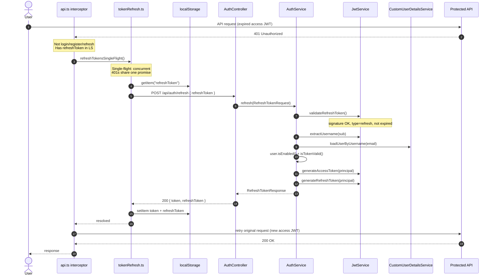
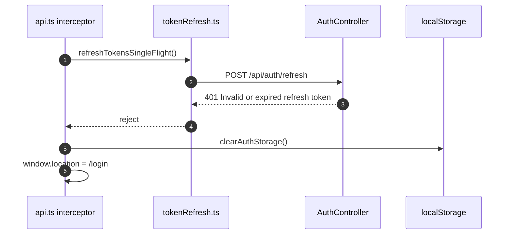

# JWT Refresh Implementation Report

**Date:** 2026-06-24  
**Scope:** Phase 1 (MVP) — stateless refresh token exchange  
**Spec:** [JWT_LIFECYCLE_REVIEW.md](JWT_LIFECYCLE_REVIEW.md) §5–§6  
**Status:** Implemented

---

## Executive Summary

Implemented end-to-end refresh token flow:

| Layer | Deliverable |
|-------|-------------|
| Backend | `POST /api/auth/refresh` — validates refresh JWT, issues new access + refresh pair |
| Security | `/api/auth/refresh` added to `permitAll` |
| Frontend | `authService.refreshToken()` + axios 401 interceptor with single-flight |
| Tests | 13 new backend tests + 2 frontend Vitest tests |

---

## Changed Files

### Backend (`flowiq-backend`)

| File | Change |
|------|--------|
| `src/main/java/com/flowiq/dto/request/RefreshTokenRequest.java` | **New** — request DTO with `@NotBlank refreshToken` |
| `src/main/java/com/flowiq/dto/response/RefreshTokenResponse.java` | **New** — `{ token, refreshToken }` response |
| `src/main/java/com/flowiq/security/JwtService.java` | Added `isRefreshToken()`, `validateRefreshToken()` |
| `src/main/java/com/flowiq/service/AuthService.java` | Added `refresh()`, injected `CustomUserDetailsService` |
| `src/main/java/com/flowiq/controller/AuthController.java` | Added `POST /api/auth/refresh` endpoint + OpenAPI |
| `src/main/java/com/flowiq/config/SecurityConfig.java` | `permitAll` for `/api/auth/refresh` |
| `src/test/java/com/flowiq/unit/security/JwtServiceTest.java` | **New** — 6 unit tests |
| `src/test/java/com/flowiq/unit/service/AuthServiceTest.java` | **New** — 5 unit tests |
| `src/test/java/com/flowiq/controller/AuthControllerRefreshTest.java` | **New** — 2 controller tests |

### Frontend (`flowiq-frontend`)

| File | Change |
|------|--------|
| `src/services/tokenRefresh.ts` | **New** — refresh API call + single-flight + storage helpers |
| `src/services/api.ts` | 401 interceptor with auto-refresh, retry, redirect on failure |
| `src/services/auth.service.ts` | Implemented `refreshToken()` via `refreshTokensSingleFlight()` |
| `src/services/tokenRefresh.test.ts` | **New** — single-flight + storage tests |
| `package.json` | Added `vitest`, `jsdom`, `test` script |
| `vitest.config.ts` | **New** — Vitest configuration |

---

## Tests Added

### Backend (108 total, all passing)

| Test class | Tests | Coverage |
|------------|-------|----------|
| `JwtServiceTest` | 6 | Access/refresh generation, `validateRefreshToken` (valid, access-as-refresh, bad signature, expired) |
| `AuthServiceTest` | 5 | Happy path, access token rejected, inactive user, missing user, expired token |
| `AuthControllerRefreshTest` | 2 | 200 with token pair, 400 on blank refresh token |

### Frontend (2 tests, all passing)

| Test file | Tests | Coverage |
|-----------|-------|----------|
| `tokenRefresh.test.ts` | 2 | Concurrent refresh deduplication (single-flight), `clearAuthStorage()` |

### CI verification

| Command | Result |
|---------|--------|
| `mvn test` (backend) | PASS — 108 tests |
| `npm test` (frontend) | PASS — 2 tests |
| `npm run build` (frontend) | PASS |

---

## New Flow — Sequence Diagram



### Failure path



---

## Validation Rules (as implemented)

`POST /api/auth/refresh` performs:

1. Parse JWT and verify HS256 signature (`JwtService.extractAllClaims`)
2. Reject if `type` claim ≠ `"refresh"` (`validateRefreshToken` + `isRefreshToken`)
3. Reject if `exp` passed
4. Load user by `sub` (email) via `CustomUserDetailsService`
5. Reject if user not found or `isEnabled() == false`
6. Verify subject match via `isTokenValid(refreshToken, userDetails)`
7. Issue new access + refresh pair (rotation at JWT level, stateless)

**Public endpoint:** no `Authorization` header required — expired access cannot call refresh with Bearer.

---

## Remaining Limitations (Phase 2+)

| Limitation | Risk | Planned remediation |
|------------|------|-------------------|
| **No server-side refresh revocation** | Stolen refresh token valid until 7d expiry | `refresh_tokens` table + hash storage (Phase 2) |
| **No refresh reuse detection** | Token replay after rotation undetected | Rotation with DB tracking (Phase 2) |
| **Logout does not revoke refresh** | Client clears LS only; refresh still works | `POST /auth/logout` with refresh body + revoke (Phase 2) |
| **localStorage storage** | XSS can steal tokens | HttpOnly cookies (Phase 3) — [JWT_STORAGE_SECURITY_REVIEW.md](JWT_STORAGE_SECURITY_REVIEW.md) |
| **Access TTL 24h** | Long window if access leaked | Shorten to 15m after refresh stable (Phase 2) |
| **No rate limiting on `/auth/refresh`** | Brute-force / abuse | TD-M07 — [AUTH_SECURITY_REVIEW.md](AUTH_SECURITY_REVIEW.md) |
| **Docs drift** | README lists refresh before this PR | Update `authentication-api.md`, frontend README |

---

## API Contract

### Request

```http
POST /api/auth/refresh
Content-Type: application/json

{
  "refreshToken": "eyJhbGciOiJIUzI1NiJ9..."
}
```

### Success — `200 OK`

```json
{
  "token": "<new-access-jwt>",
  "refreshToken": "<new-refresh-jwt>"
}
```

### Errors

| Status | Condition |
|--------|-----------|
| `400` | Blank/missing `refreshToken` |
| `401` | Invalid signature, wrong type, expired, user inactive/deleted |

---

## Frontend Interceptor Behavior

| Scenario | Behavior |
|----------|----------|
| 401 on protected endpoint | Single-flight refresh → retry once with `_retry` flag |
| 401 on `/auth/login`, `/auth/register`, `/auth/refresh` | Clear storage, no refresh attempt |
| No `refreshToken` in localStorage | Clear storage, reject |
| Refresh fails | Clear storage, redirect to `/login` |
| Concurrent 401s | Share one `refreshPromise` (deduplicated) |

Refresh uses `fetch()` directly (not `apiClient`) to avoid circular interceptor dependency.

---

## Decision Checklist (from JWT_LIFECYCLE_REVIEW §10)

- [x] `POST /api/auth/refresh` implemented per spec
- [x] `SecurityConfig` permits `/api/auth/refresh`
- [x] `JwtService` rejects `type=access` on refresh endpoint
- [x] Frontend single-flight refresh on 401
- [x] 401 on refresh → clear storage + redirect `/login`
- [x] Unit tests: service, JWT, controller
- [ ] Integration test: login → refresh → protected call (deferred — no Testcontainers auth flow yet)
- [ ] Docs + OpenAPI index pages updated (follow-up)
- [ ] Phase 2: rotation + logout revoke scheduled

---

**Owner:** Backend + Frontend  
**Related debt:** TD-C06 — [TECHNICAL_DEBT_REGISTER.md](../architecture/TECHNICAL_DEBT_REGISTER.md)
