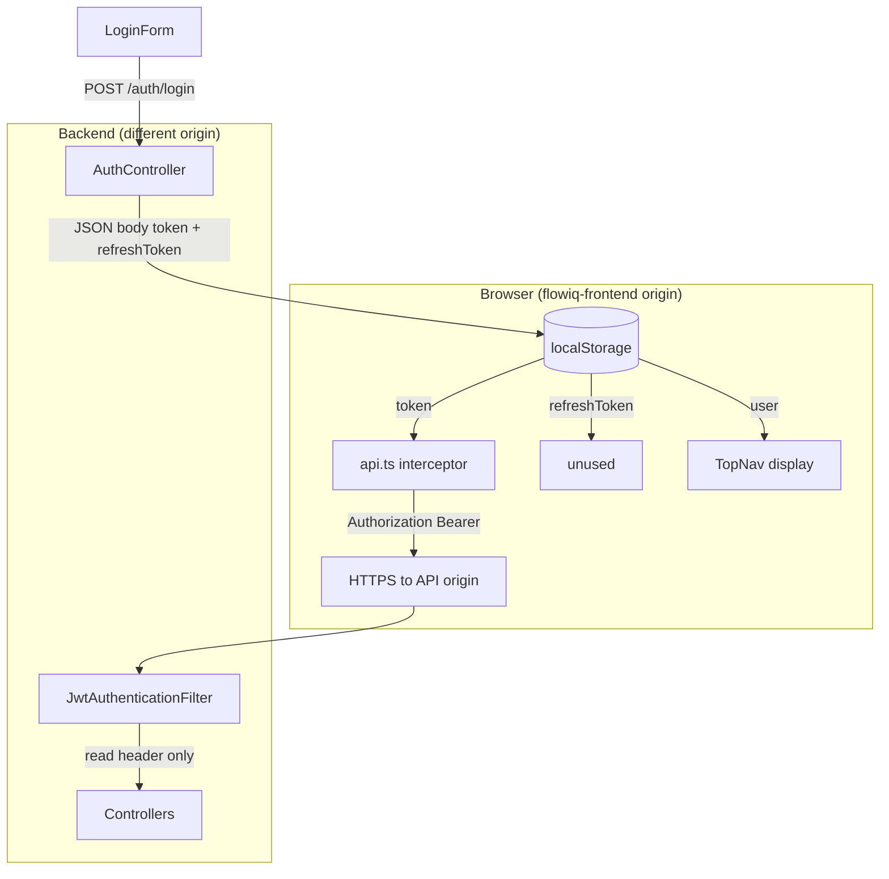
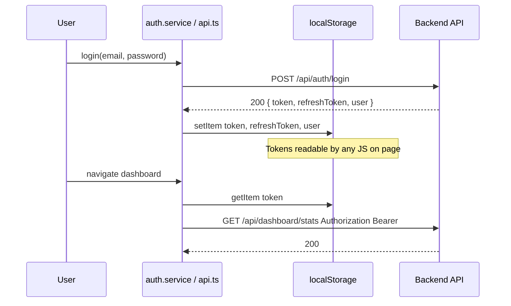
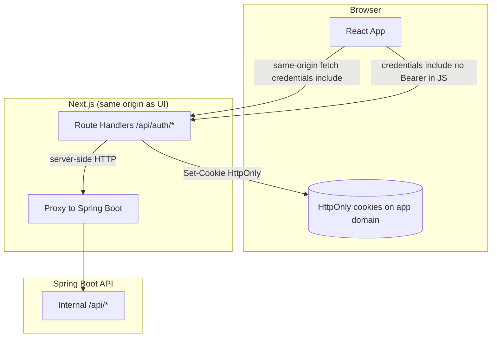
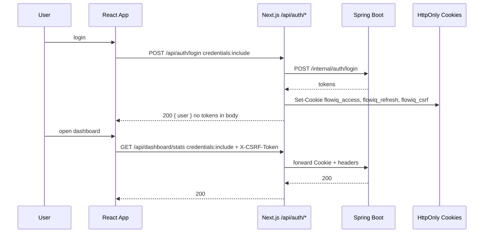
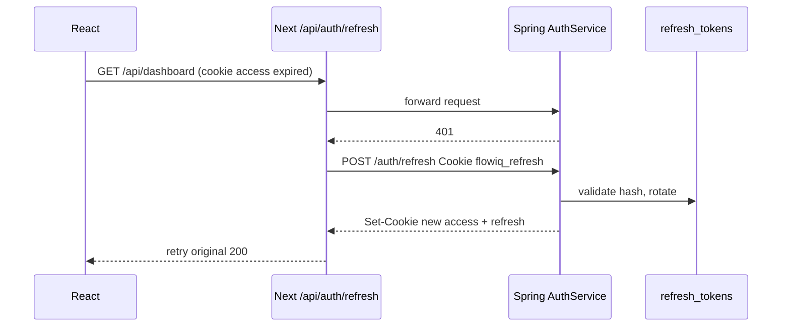

# JWT Storage Security Review

**Audit date:** 2026-06-23  
**Scope:** `flowiq-frontend` token persistence + `flowiq-backend` auth transport  
**Method:** Static code audit (grep + file review)  
**Related:** [JWT Remediation Plan](../architecture/JWT_REMEDIATION_PLAN.md) · [ADR-006](../architecture/adr/006-jwt-authentication-strategy.md) · [JWT Flow](jwt-flow.md) · TD-H10

---

## Executive Summary

| Aspect | Current state |
|--------|---------------|
| **Access token storage** | `localStorage` key `token` |
| **Refresh token storage** | `localStorage` key `refreshToken` (unused) |
| **sessionStorage** | **Not used** for auth |
| **Cookies** | **Not used** for auth |
| **Transport** | `Authorization: Bearer` (axios interceptor) |
| **Backend cookie support** | **None** — filter reads header only |
| **CORS credentials** | `allowCredentials(true)` — ready for cookies, not used |

**Verdict:** Текущая схема — классический **SPA + localStorage + Bearer**. Уязвима к **XSS token theft**. Для Production рекомендуется миграция на **HttpOnly Secure cookies** (через BFF или same-site proxy) с refresh rotation — см. [JWT Remediation Plan](../architecture/JWT_REMEDIATION_PLAN.md).

---

## 1. Current Storage Model

### 1.1 Where access token is stored

| Property | Value |
|----------|-------|
| **Mechanism** | `window.localStorage` |
| **Key** | `"token"` |
| **Format** | Raw JWT string |
| **Written** | `auth.service.ts` → `persistAuth()` after login/register |
| **Read** | `api.ts` request interceptor; `auth.service.ts` → `isAuthenticated()`, `getToken()` |
| **Cleared** | `auth.service.ts` → `clearAuth()`; `api.ts` 401 handler |

**sessionStorage:** не используется ни для access, ни для refresh.  
**Cookies:** не устанавливаются и не читаются для JWT.

### 1.2 Refresh token storage

| Key | `"refreshToken"` |
|-----|------------------|
| Written | login/register (`persistAuth`) |
| Read | **Never** (no refresh flow) |
| Cleared | logout, 401 interceptor |

### 1.3 User profile cache (non-JWT)

| Key | `"user"` | JSON `User` object — PII in localStorage |
|-----|----------|-------------------------------------------|

### 1.4 Other localStorage keys (not JWT, same XSS surface)

| Key | File | Purpose |
|-----|------|---------|
| `flowiq_language` | `PreferencesContext.tsx`, `api.ts` | Locale header |
| `flowiq_currency` | `PreferencesContext.tsx`, `api.ts` | Currency header |
| `flowiq_theme` | `apply-theme.ts`, `ThemeScript.tsx` | UI theme |

---

## 2. File Inventory — Read/Write Token

### 2.1 Files that **write** JWT tokens

| File | Operation | Keys |
|------|-----------|------|
| `flowiq-frontend/src/services/auth.service.ts` | `persistAuth()` | `token`, `refreshToken`, `user` |
| `flowiq-frontend/src/services/auth.service.ts` | `getCurrentUser()` success | `user` only |

### 2.2 Files that **read** access token

| File | Usage |
|------|-------|
| `flowiq-frontend/src/services/api.ts` | Attach `Authorization: Bearer ${token}` |
| `flowiq-frontend/src/services/auth.service.ts` | `isAuthenticated()`, `getToken()` |

### 2.3 Files that **clear** tokens

| File | Trigger |
|------|---------|
| `flowiq-frontend/src/services/auth.service.ts` | `clearAuth()` — logout, `getCurrentUser` failure |
| `flowiq-frontend/src/services/api.ts` | 401 on non-login/register endpoints |

### 2.4 Files that **gate routes** on token presence (not validity)

| File | Check |
|------|-------|
| `flowiq-frontend/src/shared/components/layout/MainLayout.tsx` | `authService.isAuthenticated()` |
| `flowiq-frontend/app/login/page.tsx` | redirect if authenticated |
| `flowiq-frontend/app/register/page.tsx` | redirect if authenticated |

### 2.5 Files that read `user` from localStorage (indirect auth UX)

| File | Usage |
|------|-------|
| `flowiq-frontend/src/shared/components/layout/TopNav.tsx` | `getStoredUser()` — instant display before `/auth/me` |

### 2.6 Backend — token handling (no browser storage)

| File | Role |
|------|------|
| `JwtService.java` | Generate JWT |
| `JwtAuthenticationFilter.java` | Parse `Authorization` header only |
| `AuthController.java` | Return tokens in **JSON body** |
| `CorsConfig.java` | `allowCredentials(true)`, allows `Authorization` header |

**`getToken()`** exported from `auth.service.ts` but **not called** by application code (only documented in README).

**Next.js middleware:** отсутствует (`middleware.ts` not found) — нет server-side auth check.

---

## 3. Current Flow Diagram



### 3.1 Sequence — current login & API call



---

## 4. Risk Assessment

### 4.1 Threat model (current)

| Threat | Likelihood | Impact | Current mitigation |
|--------|------------|--------|-------------------|
| **XSS → steal `token`** | Medium (any script injection) | **Critical** — 24h API access | **None** (token in JS-readable storage) |
| **XSS → steal `refreshToken`** | Medium | **High** (7d if refresh implemented) | **None** |
| **XSS → steal `user` PII** | Medium | Medium | None |
| **Physical access / shared PC** | Low | Medium — tokens persist until cleared | localStorage survives tab close |
| **Malicious browser extension** | Low | High — can read localStorage | None |
| **Token in memory dump** | Low | Medium | Not mitigated |
| **Logout ineffective** | High (design) | High — stolen token works until exp | See JWT Remediation Plan |
| **No CSP** | — | Increases XSS risk | `next.config.ts` has no security headers |
| **Cross-origin** | — | Cookies harder; Bearer chosen intentionally | ADR-006 |

### 4.2 Why localStorage is problematic for JWT

1. **Any JavaScript** on the page can `localStorage.getItem("token")` — including compromised npm package, inline script from XSS, third-party widget.
2. **Persistence** — survives browser restart; attacker has long window (24h access).
3. **No `HttpOnly`** — browser security model cannot hide token from scripts.
4. **Refresh token co-located** — when refresh flow ships, both secrets in same storage tier.

### 4.3 What is NOT a risk today (clarifications)

| Item | Note |
|------|------|
| CSRF on Bearer header | Custom header not sent cross-site by browsers on simple requests — **low CSRF** for API with Bearer only |
| Cookie theft via CSRF | N/A — no auth cookies |
| `sessionStorage` | Not used — no tab-scoped benefit |

### 4.4 OWASP alignment

| OWASP recommendation | FlowIQ today |
|----------------------|--------------|
| Store tokens in HttpOnly cookies | ❌ |
| Avoid localStorage for sensitive tokens | ❌ |
| Short-lived access + refresh rotation | ⚠️ Partial (tokens issued, refresh broken) |
| CSP | ❌ Not configured |
| Secure + SameSite cookies | N/A |

---

## 5. Target Architecture — HttpOnly Secure Cookies

### 5.1 Recommended pattern for FlowIQ

**Cross-origin today:** frontend (`localhost:3000` / Vercel) ≠ backend (`localhost:8080` / API host).

Для cross-origin SPA **прямая** установка cookie backend'ом на API-домен **не отправляется** браузером на XHR без `withCredentials` + `SameSite=None; Secure`, и cookie будет привязана к **API domain**, не frontend.

**Рекомендуемый target:** **BFF (Backend-for-Frontend)** на домене Next.js:



**Alternative (no BFF):** subdomains `app.flowiq.com` + `api.flowiq.com` with cookies `Domain=.flowiq.com`, `SameSite=Lax`, reverse proxy — требует unified domain и infra.

### 5.2 Target cookie design

| Cookie | HttpOnly | Secure | SameSite | Path | TTL | Content |
|--------|----------|--------|----------|------|-----|---------|
| `flowiq_access` | ✅ | ✅ (prod) | `Lax` or `Strict` (same-site BFF) | `/api` | 15 min | JWT access **or** opaque session id |
| `flowiq_refresh` | ✅ | ✅ | `Strict` | `/api/auth` | 30 days | JWT refresh **or** opaque id |
| `flowiq_csrf` | ❌ (readable) | ✅ | `Strict` | `/` | session | CSRF double-submit token |

**Правило:** JavaScript **никогда** не читает JWT. `authService.isAuthenticated()` → `GET /api/auth/me` or `GET /api/auth/session` (cookie sent automatically).

### 5.3 Target flow diagram



---

## 6. Migration Prerequisites

| Prerequisite | Why |
|--------------|-----|
| `POST /api/auth/refresh` implemented | Refresh must work before storage migration |
| Refresh rotation + server revoke | Cookie theft mitigation |
| CSRF strategy | Cookie auth enables CSRF — **mandatory** |
| `JWT_REMEDIATION_PLAN` Wave 1–2 | Lifecycle before storage |
| Staging with HTTPS | `Secure` cookies require TLS |
| E2E auth tests update | automation uses Bearer today |

### 6.1 HttpOnly migration effort estimate

| Area | Complexity |
|------|------------|
| BFF route handlers | **High** — new Next.js layer |
| Backend dual-mode (header + cookie) | **Medium** — transition period |
| CORS simplification (same-origin BFF) | **Low** for browser→BFF |
| CSRF | **Medium** |
| Frontend auth refactor | **Medium** |
| Automation/contract tests | **Medium** |

---

## 7. Step-by-Step Migration Plan

### Phase 0 — Hardening without cookies (Week 1–2)

*Подготовка; не ломает текущий flow.*

| Step | Backend | Frontend |
|------|---------|----------|
| 0.1 | Implement `POST /api/auth/refresh` | Axios 401 → refresh retry |
| 0.2 | Env-based `jwt.secret` | — |
| 0.3 | — | Add CSP headers in `next.config.ts` |
| 0.4 | — | Remove dead `getToken()` usage from public API docs |

**Storage:** still localStorage — но refresh работает.

---

### Phase 1 — Backend changes (cookie-ready)

#### 1.1 `JwtAuthenticationFilter` — dual extraction

```java
// Pseudocode — support transition
String jwt = resolveFromAuthorizationHeader(request);
if (jwt == null) {
    jwt = resolveFromCookie(request, "flowiq_access");
}
```

#### 1.2 `AuthController` / `AuthService` — cookie response mode

Feature flag: `flowiq.auth.cookie-mode=false` (default).

When `cookie-mode=true` on login/register/refresh:

```java
ResponseCookie accessCookie = ResponseCookie.from("flowiq_access", accessJwt)
    .httpOnly(true).secure(true).sameSite("Strict")
    .path("/api").maxAge(Duration.ofMinutes(15)).build();
response.addHeader(HttpHeaders.SET_COOKIE, accessCookie.toString());
// AuthResponse body: user only, tokens null or omitted
```

#### 1.3 Logout — clear cookies server-side

```java
ResponseCookie clearAccess = ResponseCookie.from("flowiq_access", "")
    .httpOnly(true).secure(true).maxAge(0).build();
// + revoke refresh in DB (JWT Remediation Plan)
```

#### 1.4 CSRF protection

| Approach | Implementation |
|----------|----------------|
| **Double-submit** | Non-HttpOnly `flowiq_csrf` + header `X-CSRF-Token` on POST/PUT/DELETE |
| Spring | `CookieCsrfTokenRepository` or custom filter for `/api/**` mutations |

Exclude: `POST /api/auth/login`, `/register`, `/refresh` (or use SameSite=Strict only).

#### 1.5 Internal API (if BFF)

- New profile `internal` — BFF calls Spring with service token or mTLS
- Or Spring only listens on private network; public ingress = Next.js only

---

### Phase 2 — Frontend changes

#### 2.1 Axios / fetch configuration

```typescript
// Target api.ts
export const apiClient = axios.create({
  baseURL: "/api",              // same-origin BFF, not NEXT_PUBLIC_API_URL
  withCredentials: true,        // send cookies
});
// REMOVE: localStorage token read
// REMOVE: Authorization header from JS
```

#### 2.2 `auth.service.ts` refactor

| Before | After |
|--------|-------|
| `persistAuth` writes tokens | `persistAuth` stores `user` in **React state/context only** (optional sessionStorage for display) |
| `isAuthenticated()` checks localStorage | `isAuthenticated()` → async `GET /api/auth/me` or session endpoint |
| `getToken()` | **Remove** from public API |
| `clearAuth()` removes localStorage tokens | `clearAuth()` calls logout endpoint; cookies cleared by server |

#### 2.3 Auth context (recommended)

```typescript
// AuthProvider — user in memory, hydrate from /auth/me on mount
const [user, setUser] = useState<User | null>(null);
```

#### 2.4 `MainLayout` / login pages

- Replace sync `isAuthenticated()` with `useAuth().loading / user`
- Server Components: optional session check via BFF in layout (future)

#### 2.5 BFF Route Handlers (Next.js App Router)

| Route | Action |
|-------|--------|
| `app/api/auth/login/route.ts` | Proxy → Spring; forward `Set-Cookie` |
| `app/api/auth/logout/route.ts` | Proxy + clear cookies |
| `app/api/auth/refresh/route.ts` | Proxy refresh |
| `app/api/[...path]/route.ts` | Optional generic proxy for all `/api/*` |

Env: `BACKEND_INTERNAL_URL=http://spring:8080/api` (server-only, not `NEXT_PUBLIC_`).

#### 2.6 TopNav

- Remove `getStoredUser()` from localStorage
- Use `AuthContext.user`

---

### Phase 3 — CORS changes

#### Current (direct SPA → Spring)

```java
// CorsConfig.java — today
setAllowedOrigins(localhost:3000, vercel.app);
setAllowCredentials(true);
setAllowedHeaders(Authorization, ...);
```

#### Target Option A — BFF (recommended)

| Traffic | CORS needed? |
|---------|--------------|
| Browser → Next.js `/api/*` | **No** — same origin |
| Next.js → Spring (server-side) | **No** — server-to-server |

**Spring `CorsConfig`:** restrict to BFF origin / internal network only; remove public Vercel from allowed origins for direct access.

#### Target Option B — Direct cookies (same parent domain)

```java
configuration.setAllowedOrigins(List.of("https://app.flowiq.com"));
configuration.setAllowCredentials(true);
configuration.setAllowedHeaders(List.of("X-CSRF-Token", "Content-Type", ...));
// MUST NOT use allowedOrigins("*") with credentials
```

Frontend:

```typescript
axios.create({ baseURL: "https://api.flowiq.com/api", withCredentials: true });
```

Cookie: `Domain=.flowiq.com; SameSite=None; Secure` (cross-subdomain).

---

### Phase 4 — Logout changes

| Step | Action |
|------|--------|
| 4.1 | Backend revokes refresh token family (DB) |
| 4.2 | Backend returns `Set-Cookie` with `Max-Age=0` for access + refresh |
| 4.3 | BFF forwards cookie clearing headers |
| 4.4 | Frontend `logout()` — `POST /api/auth/logout` with `credentials: include` |
| 4.5 | Clear client state only (`user` in context) — **not** tokens |
| 4.6 | Optional: Redis denylist access `jti` (15 min TTL) |

---

### Phase 5 — Refresh token flow (cookie-based)



| Rule | Detail |
|------|--------|
| Refresh transport | **HttpOnly cookie only** — not in JSON body |
| Refresh endpoint | `POST /api/auth/refresh` — no body; cookie auto-sent |
| Rotation | New `flowiq_refresh` on each refresh |
| JS access | **Forbidden** — browser handles cookie |
| 401 fallback | Redirect `/login` |

BFF refresh handler:

1. Read `flowiq_refresh` from incoming cookie  
2. Call Spring refresh (internal)  
3. Forward `Set-Cookie` to browser  
4. Retry failed request or return 401 → login  

---

### Phase 6 — Cutover & cleanup

| Step | Action |
|------|--------|
| 6.1 | Feature flag `flowiq.auth.cookie-mode=true` in staging |
| 6.2 | E2E: login, API calls, refresh, logout |
| 6.3 | Remove `localStorage` token keys (migration script in frontend: one-time `removeItem`) |
| 6.4 | Deprecate Bearer mode in prod (`cookie-mode` only) |
| 6.5 | Update `authentication-api.md`, `jwt-flow.md`, ADR-006 amendment |
| 6.6 | Update automation agents to use cookie jar or BFF test harness |

---

## 8. Transition Matrix (dual-mode period)

| Mode | Access transport | Refresh | localStorage |
|------|------------------|---------|--------------|
| **Legacy** | Bearer from localStorage | Body (if implemented) | `token`, `refreshToken` |
| **Hybrid** | Cookie **or** Bearer (filter accepts both) | Cookie preferred | Deprecated, cleared on login |
| **Target** | HttpOnly cookie only | HttpOnly cookie only | **No JWT keys** |

**Feature flag:** `flowiq.auth.storage-mode=localStorage|cookie|hybrid`

---

## 9. Comparison — Current vs Target

| Dimension | Current (localStorage) | Target (HttpOnly cookies) |
|-----------|------------------------|---------------------------|
| XSS steals JWT | **Yes** | **No** (HttpOnly) |
| CSRF risk | Low | **Higher** — needs CSRF token |
| Cross-origin | Easy (Bearer header) | Needs BFF or shared domain |
| Mobile API clients | Same Bearer pattern | Separate token endpoint for native |
| SSR / RSC auth | Not supported | Possible via BFF cookies |
| Logout | Client-only | Server clears cookies + revoke |
| Dev localhost | Simple | BFF proxy or `Secure=false` dev flag |
| Testing | Easy (set header) | Cookie jar in tests |

---

## 10. Dev / Localhost Considerations

| Issue | Mitigation |
|-------|------------|
| `Secure` requires HTTPS | `mkcert` local TLS or `Secure=false` only in `dev` profile |
| Cross-port (3000→8080) | Use Next.js proxy — browser sees single origin |
| Swagger UI | Keep Bearer auth for direct API testing in dev profile |
| Docker Compose | BFF in frontend container proxies to `flowiq-backend:8080` |

```typescript
// next.config.ts — dev rewrite (optional Phase 1)
async rewrites() {
  return [{ source: "/api/:path*", destination: "http://localhost:8080/api/:path*" }];
}
```

*Note: rewrites alone do not set HttpOnly cookies from Spring on frontend domain — BFF Route Handler still needed for `Set-Cookie` on app origin.*

---

## 11. Test Checklist (post-migration)

- [ ] Login sets cookies — not visible in `document.cookie` for HttpOnly  
- [ ] `localStorage` contains no `token` / `refreshToken`  
- [ ] API calls work without `Authorization` header in JS  
- [ ] CSRF: mutation without token → 403  
- [ ] Refresh: expired access → auto-refresh → success  
- [ ] Logout: cookies cleared; subsequent API → 401  
- [ ] XSS simulation: injected script cannot read JWT  
- [ ] Cross-tab: logout in one tab invalidates other (after refresh attempt)  
- [ ] Automation PR validation updated  

---

## 12. Related Documents & Debt

| Item | Link |
|------|------|
| JWT lifecycle (refresh, rotation, logout) | [JWT_REMEDIATION_PLAN.md](../architecture/JWT_REMEDIATION_PLAN.md) |
| ADR decision (Bearer rationale) | [ADR-006](../architecture/adr/006-jwt-authentication-strategy.md) |
| TD-H10 localStorage XSS | [TECHNICAL_DEBT_REGISTER.md](../architecture/TECHNICAL_DEBT_REGISTER.md) |
| Authentication API | [authentication-api.md](../api/authentication-api.md) |

---

## 13. Decision Record

| Question | Answer |
|----------|--------|
| Where is access token stored? | **`localStorage["token"]`** |
| sessionStorage? | **No** |
| Cookies? | **No** |
| Primary risk? | **XSS → full account takeover (24h)** |
| Recommended migration? | **BFF + HttpOnly cookies + CSRF + refresh rotation** |
| Can we migrate cookies only without BFF? | Only with **same-site domain** or `SameSite=None` cross-site (weaker) |
| First step? | Implement refresh lifecycle (JWT Remediation Wave 1), then BFF |

---

**Status:** Proposed — documentation only, no code changes in this audit  
**Owner:** Frontend + Backend + Platform  
**Suggested timeline:** Phase 0–1 after JWT Remediation Wave 1; full cookie cutover Month 2–3
