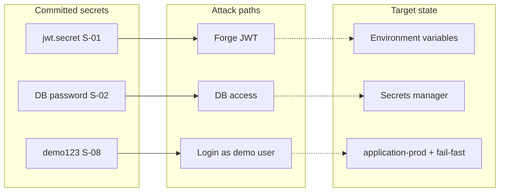

# Secrets Audit Report

**Audit date:** 2026-06-23  
**Scope:** `flowiq-backend` (primary), cross-references to `flowiq-frontend`, `flowiq-automation`  
**Method:** Static scan — `application*.properties`, `compose.yaml`, Java constants, CI workflows, docs  
**Excluded:** `reportportal.properties` (per project policy)  
**Related:** TD-C03 · TD-H12 · [JWT Remediation Plan](../architecture/JWT_REMEDIATION_PLAN.md) · [Data Protection](data-protection.md)

---

## Executive Summary

| Finding | Count |
|---------|-------|
| **Critical** secrets in committed config | **2** (JWT secret, DB password) |
| **High** hardcoded credentials in runtime code | **2** (demo email/password + log leak) |
| **External API keys** (bank, LLM, payment) | **0** — not integrated |
| **Hardcoded JWT tokens** | **0** |
| **`application-prod.properties`** | **Missing** |
| **`.env` committed** | **None** in backend |

**Verdict:** Dev secrets are **acceptable for local Docker** only if never reused in Production. Production deploy with current `application.properties` would expose forgeable JWTs and predictable DB credentials (TD-C03).

---

## 1. Secrets Inventory

### 1.1 Runtime configuration (backend)

| ID | Secret type | Value (as found) | Location | In Git? | Severity | Production risk |
|----|-------------|------------------|----------|---------|----------|-----------------|
| **S-01** | JWT signing key (`jwt.secret`) | `flowiq-dev-secret-key-change-in-production-min-256-bits-long!!` | `src/main/resources/application.properties:39` | ✅ | **Critical** | Anyone with repo can **forge任意 JWT** for any user |
| **S-02** | PostgreSQL password | `flowiq123` | `application.properties:6` | ✅ | **Critical** | If prod DB uses same password → full data breach |
| **S-03** | PostgreSQL password | `flowiq123` | `application-docker.properties:5` | ✅ | **High** | Docker profile inherits weak password |
| **S-04** | PostgreSQL password | `flowiq123` | `compose.yaml:8` (`POSTGRES_PASSWORD`) | ✅ | **Medium** | Local/dev infra only — OK if isolated |
| **S-05** | DB username | `flowiq` | `application.properties:5`, `compose.yaml:7` | ✅ | **Low** | Not secret alone; aids brute-force |
| **S-06** | JDBC URL | `jdbc:postgresql://localhost:5432/flowiq` | `application.properties:4` | ✅ | **Low** | Infrastructure hint |

### 1.2 Hardcoded application credentials (backend Java)

| ID | Secret type | Value | Location | In Git? | Severity | Production risk |
|----|-------------|-------|----------|---------|----------|-----------------|
| **S-07** | Demo user email | `demo@flowiq.ai` | `DemoUserSeedService.java:18` | ✅ | **Medium** | Known account name for attacks |
| **S-08** | Demo user password (plaintext) | `demo123` | `DemoUserSeedService.java:19` | ✅ | **High** | **Backdoor** if demo user exists in prod |
| **S-09** | Demo password in logs | `demo123` printed | `DemoUserSeedService.java:41` `log.info(...)` | ✅ | **High** | Credentials in log aggregators |

### 1.3 Frontend

| ID | Secret type | Value | Location | In Git? | Severity | Production risk |
|----|-------------|-------|----------|---------|----------|-----------------|
| **S-10** | API base URL | `http://localhost:8080/api` (default) | `api.ts:3` | ✅ | **Low** | Public URL, not a secret |
| **S-11** | JWT in browser | User tokens at runtime | `localStorage` (`token`, `refreshToken`) | Runtime | **High** | XSS surface — see [JWT Storage Review](JWT_STORAGE_SECURITY_REVIEW.md) |
| **S-12** | `NEXT_PUBLIC_*` secrets | None found | — | — | — | **Good** — no secrets in `NEXT_PUBLIC_` vars |

**No** `sessionStorage`, cookies, or `.env` files with secrets in frontend repo.

### 1.4 Automation / test infrastructure

| ID | Secret type | Value | Location | In Git? | Severity | Notes |
|----|-------------|-------|----------|---------|----------|-------|
| **S-13** | JWT secret (default) | Same as S-01 | `flowiq-automation/docker-compose.yml:50` | ✅ | **Medium** | `${JWT_SECRET:-default}` pattern |
| **S-14** | DB password (default) | `flowiq123` | `flowiq-automation/docker-compose.yml`, `local.properties` | ✅ | **Medium** | Test stack only |
| **S-15** | Test user password | `demo123` | `automation/.env.example`, `local.properties` | ✅ | **Low** | Documented test creds |
| **S-16** | GitHub PAT reference | `${{ secrets.GH_PAT }}` | `pr-validation.yml` | ✅ | **Low** | **Reference only** — not a leaked token |
| **S-17** | CI hardcoded DB pass | `flowiq123` | `pr-validation.yml:107,119` | ✅ | **Medium** | Ephemeral CI Postgres — acceptable if isolated |

### 1.5 Documentation (not runtime, but exposure)

| ID | Content | Locations | Severity |
|----|---------|-----------|----------|
| **S-18** | Full JWT secret echoed | `docs/security/jwt-flow.md:42` | **Medium** |
| **S-19** | Demo creds in docs | `README.md`, `local-setup.md`, `authentication-api.md`, etc. | **Low** |
| **S-20** | DB password in docs | `DATABASE_SETUP.md`, `docker.md`, `database-architecture.md` | **Low** |

### 1.6 Not found (verified)

| Category | Status |
|----------|--------|
| Bank / payment API keys | ❌ `flowiq.features.bank-integrations-enabled=false` |
| LLM API keys (OpenAI, etc.) | ❌ No SDK / keys in `pom.xml` |
| OAuth client secrets | ❌ |
| AWS / GCP access keys | ❌ |
| Hardcoded Bearer JWT strings | ❌ |
| `application-prod.properties` | ❌ Missing |
| Committed `.env` / `credentials.json` | ❌ in backend |
| Private keys / certificates | ❌ |

### 1.7 Swagger / DTO examples (non-secrets)

| Item | Value | Location | Severity |
|------|-------|----------|----------|
| Login example password | `password123` | `LoginRequest.java:18` | **Info** — OpenAPI example only |
| Unit test password | `"password"` | `SecurityTestSupport.java:17` | **Info** — test fixture |

---

## 2. Severity Definitions

| Level | Meaning | Action |
|-------|---------|--------|
| **Critical** | Direct production compromise if defaults used | Block prod deploy until fixed |
| **High** | Significant abuse path (demo backdoor, log leak) | Fix in Month 1 |
| **Medium** | Dev/CI exposure; dangerous if copied to prod | Env vars + docs |
| **Low** | Public or test-only with isolation | Document + optional cleanup |
| **Info** | Examples, not real credentials | No action |

---

## 3. Risk Summary



| Risk | Trigger | Impact |
|------|---------|--------|
| JWT forgery | Attacker reads `jwt.secret` from JAR/properties | Impersonate any user, including ADMIN |
| DB compromise | Port 5432 exposed + `flowiq123` | Read/write all financial data |
| Demo account | `DemoUserSeedService` runs in prod | Known password login |
| Log exfiltration | Startup log contains `demo123` | Credential leak to SIEM |
| Secret reuse | Same values in dev → staging → prod | Single breach affects all envs |

---

## 4. Migration Plan — Environment Variables

### Phase 0 — Policy (Day 1)

- [ ] Add `SECRETS_AUDIT.md` to security review checklist  
- [ ] Rule: **no new secrets in `application.properties`** — use `${ENV_VAR}` only  
- [ ] Add `.env.example` to backend (gitignored `.env` for local)  
- [ ] Pre-commit / CI grep for `jwt.secret=` literal (optional)

### Phase 1 — Backend config split (Week 1)

| Step | Action |
|------|--------|
| 1.1 | Create `application-prod.properties` — **no default values** for secrets |
| 1.2 | Change `application.properties` to `${VAR:local-default}` for dev only |
| 1.3 | Add `JwtSecretValidator` — `IllegalStateException` if prod profile + dev secret |
| 1.4 | Add `flowiq.demo-user.enabled` default `true` dev, `false` prod |
| 1.5 | Remove plaintext password from `log.info` in `DemoUserSeedService` |

### Phase 2 — Docker & Compose (Week 1)

| Step | Action |
|------|--------|
| 2.1 | `compose.yaml`: `POSTGRES_PASSWORD: ${POSTGRES_PASSWORD:-flowiq123}` |
| 2.2 | Add `compose.env.example` (committed) + `compose.env` (gitignored) |
| 2.3 | Document `docker compose --env-file compose.env up` |

### Phase 3 — CI/CD secrets (Week 2)

| Step | Action |
|------|--------|
| 3.1 | Backend deploy workflow: inject secrets from GitHub Actions / cloud SM |
| 3.2 | Automation: replace hardcoded `flowiq123` in `pr-validation.yml` with `${{ secrets.* }}` or Testcontainers random password |
| 3.3 | Staging/prod: unique passwords per environment |

### Phase 4 — Production (before go-live)

| Step | Action |
|------|--------|
| 4.1 | Generate JWT secret: `openssl rand -base64 64` |
| 4.2 | Store in secrets manager (AWS SM, GCP SM, Azure KV, or GitHub Environment secrets) |
| 4.3 | Rotate DB password; update connection string |
| 4.4 | Disable `DemoUserSeedService` in prod |
| 4.5 | Disable Swagger in prod profile (TD-H13) |
| 4.6 | Set `spring.jpa.show-sql=false` |

### Phase 5 — Ongoing

- [ ] Secret rotation calendar (JWT yearly, DB quarterly)  
- [ ] Audit log on auth events (TD-C02)  
- [ ] Dependabot + secret scanning (GitHub Advanced Security)  

---

## 5. Example `application.properties` After Migration

### 5.1 `src/main/resources/application.properties` (development defaults)

```properties
spring.application.name=flowiq-backend

# Database — local defaults via env override
spring.datasource.url=${DB_URL:jdbc:postgresql://localhost:5432/flowiq}
spring.datasource.username=${DB_USERNAME:flowiq}
spring.datasource.password=${DB_PASSWORD:flowiq123}
spring.datasource.driver-class-name=org.postgresql.Driver

# JPA
spring.jpa.hibernate.ddl-auto=validate
spring.jpa.show-sql=${SHOW_SQL:true}

# Flyway
spring.flyway.enabled=true
spring.flyway.locations=classpath:db/migration

# Docker Compose (local)
spring.docker.compose.enabled=${SPRING_DOCKER_COMPOSE_ENABLED:true}
spring.docker.compose.file=compose.yaml

# JWT — override via JWT_SECRET in .env or shell
jwt.secret=${JWT_SECRET:flowiq-dev-secret-key-change-in-production-min-256-bits-long!!}
jwt.access-token-expiration=${JWT_ACCESS_EXPIRATION:86400000}
jwt.refresh-token-expiration=${JWT_REFRESH_EXPIRATION:604800000}

# Feature flags
flowiq.features.bank-integrations-enabled=false
flowiq.features.demo-seed-enabled=${DEMO_SEED_ENABLED:true}
flowiq.demo-user.enabled=${DEMO_USER_ENABLED:true}
```

### 5.2 `src/main/resources/application-prod.properties` (new)

```properties
# Production — NO inline secrets; all values from environment / secrets manager

spring.jpa.show-sql=false
spring.docker.compose.enabled=false

spring.datasource.url=${DB_URL}
spring.datasource.username=${DB_USERNAME}
spring.datasource.password=${DB_PASSWORD}

jwt.secret=${JWT_SECRET}
jwt.access-token-expiration=${JWT_ACCESS_EXPIRATION:900000}
jwt.refresh-token-expiration=${JWT_REFRESH_EXPIRATION:2592000000}

flowiq.features.demo-seed-enabled=false
flowiq.demo-user.enabled=false

springdoc.swagger-ui.enabled=false
springdoc.api-docs.enabled=false
```

### 5.3 Local developer `.env` (gitignored)

```bash
# Copy from .env.example — never commit .env

DB_URL=jdbc:postgresql://localhost:5432/flowiq
DB_USERNAME=flowiq
DB_PASSWORD=flowiq123

JWT_SECRET=flowiq-dev-secret-key-change-in-production-min-256-bits-long!!

DEMO_USER_ENABLED=true
DEMO_SEED_ENABLED=true
SPRING_DOCKER_COMPOSE_ENABLED=true
```

**Load options:** IDE env vars, `docker compose --env-file`, or Spring Boot 2.4+ `spring.config.import=optional:file:.env[.properties]`.

### 5.4 `compose.env.example` (committed)

```bash
POSTGRES_DB=flowiq
POSTGRES_USER=flowiq
POSTGRES_PASSWORD=flowiq123
```

---

## 6. Example GitHub Secrets

### 6.1 Repository: `flowiq-backend`

**Environment: `staging`**

| Secret name | Description | Example generation |
|-------------|-------------|-------------------|
| `DB_URL` | JDBC URL | `jdbc:postgresql://staging-db.internal:5432/flowiq` |
| `DB_USERNAME` | DB user | `flowiq_app` |
| `DB_PASSWORD` | DB password | `openssl rand -base64 24` |
| `JWT_SECRET` | HMAC signing key (≥256 bits) | `openssl rand -base64 64` |
| `JWT_ACCESS_EXPIRATION` | Optional override | `900000` |
| `JWT_REFRESH_EXPIRATION` | Optional override | `2592000000` |

**Environment: `production`**

Same keys as staging — **different values** (never reuse passwords).

**Workflow usage example:**

```yaml
# .github/workflows/deploy.yml (future)
jobs:
  deploy:
    environment: production
    steps:
      - name: Deploy backend
        env:
          SPRING_PROFILES_ACTIVE: prod
          DB_URL: ${{ secrets.DB_URL }}
          DB_USERNAME: ${{ secrets.DB_USERNAME }}
          DB_PASSWORD: ${{ secrets.DB_PASSWORD }}
          JWT_SECRET: ${{ secrets.JWT_SECRET }}
        run: |
          # deploy command — ECS, K8s, SSH, etc.
```

### 6.2 Repository: `flowiq-frontend`

| Secret name | Description |
|-------------|-------------|
| `NEXT_PUBLIC_API_URL` | Public API URL (not secret, use Variables) |

Use **GitHub Variables** (not Secrets) for `NEXT_PUBLIC_API_URL` — it is exposed to the browser.

| Variable name | Example |
|---------------|---------|
| `NEXT_PUBLIC_API_URL` | `https://api.flowiq.com/api` |

### 6.3 Repository: `flowiq-automation`

| Secret name | Description |
|-------------|-------------|
| `TEST_USER_EMAIL` | E2E test account email |
| `TEST_USER_PASSWORD` | E2E test account password |
| `GH_PAT` | Optional PAT for cross-repo checkout |
| `DB_PASSWORD` | Staging DB for regression (if applicable) |

**Already used in:** `nightly-regression.yml`, `ui-smoke.yml`, `api-smoke.yml`.

### 6.4 Organization-level (optional)

| Secret | Purpose |
|--------|---------|
| `FLOWIQ_PROD_JWT_SECRET` | Shared rotation reference |
| `FLOWIQ_STAGING_DB_PASSWORD` | Central DB creds |

Prefer **environment-scoped** secrets over repo-wide for blast-radius control.

---

## 7. Startup Validation (recommended)

```java
// Pseudocode — JwtSecretValidator @Component
@EventListener(ApplicationReadyEvent.class)
void validateProdSecrets() {
    if (!activeProfile.contains("prod")) return;

    if (DEV_JWT_SECRET.equals(jwtSecret)) {
        throw new IllegalStateException("JWT_SECRET must not use dev default in prod");
    }
    if (jwtSecret.length() < 32) {
        throw new IllegalStateException("JWT_SECRET too short");
    }
}
```

---

## 8. Secret Rotation Playbook

| Secret | Rotation steps |
|--------|----------------|
| **JWT_SECRET** | Deploy new secret → all users re-login (or dual-key validation window) → revoke old |
| **DB_PASSWORD** | Update DB user → deploy new `DB_PASSWORD` → rolling restart |
| **Demo user** | Disable in prod; rotate password in staging if enabled |

---

## 9. Compliance Checklist

- [ ] S-01 JWT secret externalized for prod  
- [ ] S-02 DB password externalized for prod  
- [ ] S-08 Demo user disabled in prod  
- [ ] S-09 Password removed from startup logs  
- [ ] `application-prod.properties` created  
- [ ] GitHub Environment secrets configured  
- [ ] `.env` in `.gitignore`  
- [ ] No Critical items in production deploy manifest  

---

## 10. Code & Config Anchors

| ID | Path |
|----|------|
| S-01, S-02 | `src/main/resources/application.properties` |
| S-03 | `src/main/resources/application-docker.properties` |
| S-04 | `compose.yaml` |
| S-07–S-09 | `src/main/java/com/flowiq/service/DemoUserSeedService.java` |
| S-01 consumer | `src/main/java/com/flowiq/security/JwtService.java:20` |
| CI (no secrets) | `.github/workflows/backend-ci.yml` |
| Debt | TD-C03, TD-H12 in `docs/architecture/TECHNICAL_DEBT_REGISTER.md` |

---

**Status:** Audit complete — remediation tracked in TD-C03 (Month 1 Week 1)  
**Next review:** Before first production deploy or after any secret rotation
