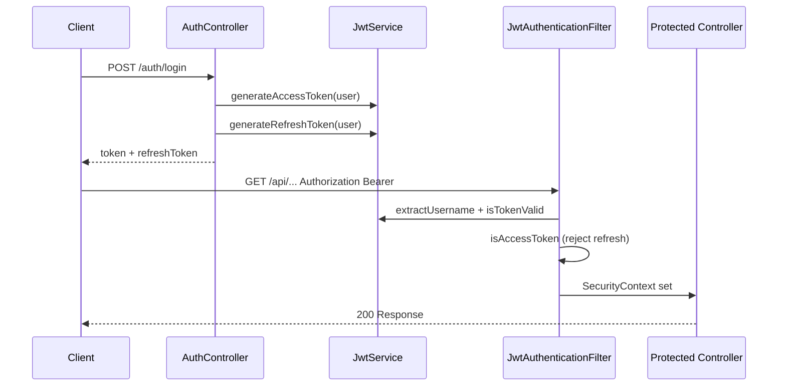

# JWT Flow



## Token Structure

| Claim | Purpose |
|-------|---------|
| `sub` | User email |
| `userId` | Database ID |
| `role` | USER/ADMIN/VIEWER |
| `type` | `access` or `refresh` |

## Expiration (Development)

| Type | ms | Duration |
|------|-----|----------|
| access | 86400000 | 24h |
| refresh | 604800000 | 7d |

## Configuration

```properties
jwt.secret=flowiq-dev-secret-key-change-in-production-min-256-bits-long!!
jwt.access-token-expiration=86400000
jwt.refresh-token-expiration=604800000
```

**Production:** Rotate secret via secrets manager; shorten access token TTL.

## Refresh Gap

Refresh tokens issued but **no `/auth/refresh` endpoint**. Frontend `refreshToken()` throws not implemented.

## Related

- [Authentication](authentication.md)
